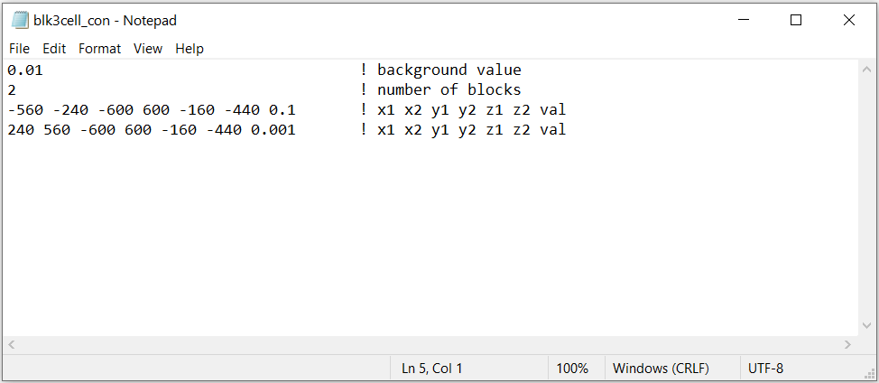
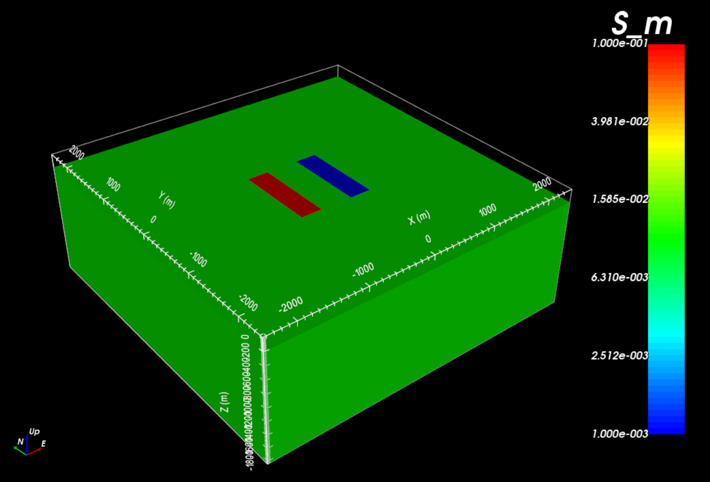
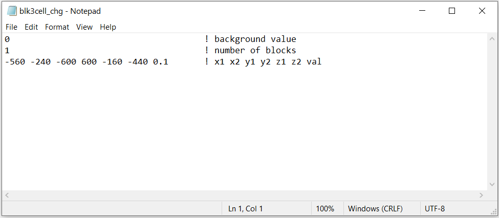
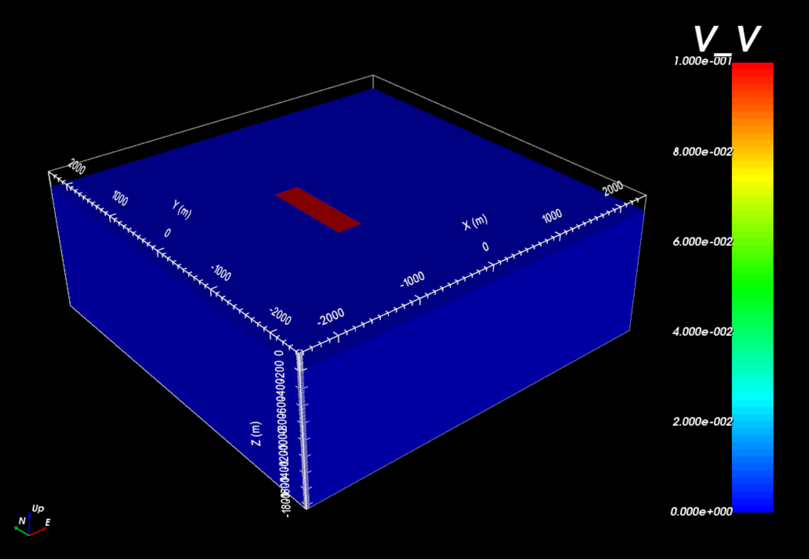

.. _example_model:

Create Model
============

Here, the code **blk3cell.exe** is used to create both a conductivity and an intrinsic chargeability model on the tensor mesh provided. Files relevant to this part of the example are in the sub-folder *tensor_model*. Before running this example, you may want to do the following:

	- `Download and open the zip folder containing the entire DCIP octree example <https://github.com/ubcgif/DCIPoctree/raw/master/assets/dcipoctree_example.zip>`__ (if not done already)
	- Learn how to run :ref:`blk3cellOct<dcip_model>`
	- Learn the format of the input files :ref:`blk3cellOct.inp<dcip_input_model>`

**Tensor mesh:** Here is the tensor mesh used throughout the example.

.. figure:: ../inputfiles/images/tensor_mesh.png
     :align: center
     :width: 700

**Conductivity model:** Here is the input file for the conductivity model (**blk3cell_con.inp**)

The resulting conductivity model shows a more conductive block (:math:`\sigma` = 0.1 S/m) to the West and a more resistive block (:math:`\sigma` = 0.001 S/m) to the East within a moderatively conductive background (:math:`\sigma_b` = 0.01 S/m).

**Chargeability model:** Here is the input file for the chargeability model (**blk3cell_chg.inp**)

The resulting chargeability model shows the more conductive block to the West is also chargeable (:math:`\eta` = 0.1 V/V), but the more more resistive block to the East is not. The background is also non-chargeable.

