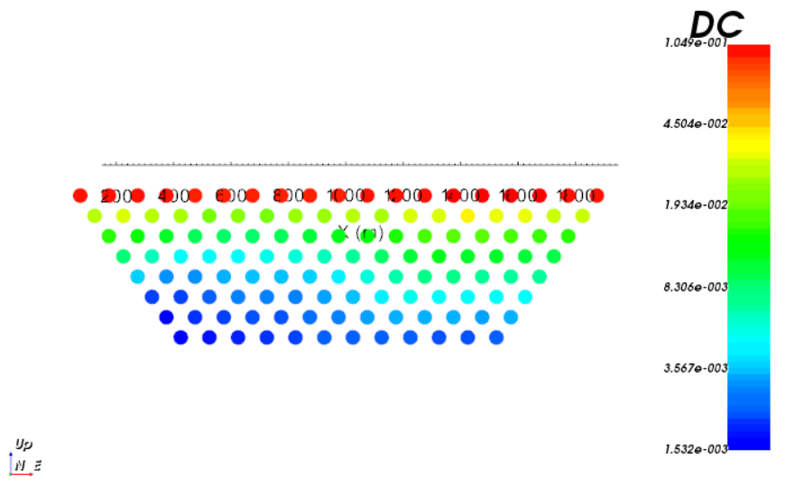
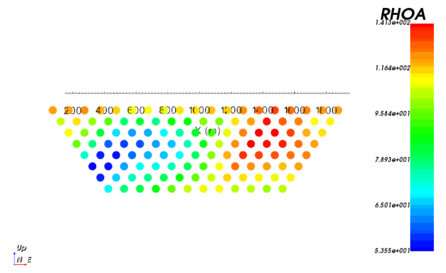

.. _example_dc_fwd:

DC Forward Modeling
===================

Here, the code **dcipf3d.exe** and the input file **dc_fwd.inp** (:ref:`see format <dcip_input_fwd>`) are used to forward model DC data along 9 pole-dipole profile lines oriented West to East. Files relevant to this part of the example are in the sub-folder *dc_fwd*. For this example, we use the conductivity model that was created in the example ":ref:`create model<example_model>`". Before running this example, you may want to do the following:

	- `Download and open the zip folder containing the entire DCIP octree example <https://github.com/ubcgif/DCIPoctree/raw/master/assets/dcipoctree_example.zip>`__ (if not done already)
	- :ref:`Learn how to run code from command line <dcip_fwd>`
	- :ref:`Learn the format of the input file <dcip_input_fwd>`

To forward model the data, the following input file was used:

.. figure:: ../inputfiles/images/create_dc_fwd_input.png
     :align: center
     :width: 700

The DC data are the measured voltage normalized by the transmitter current. The code also outputs the corresponding apparent resistivity values. Below, we show the 2D pseudo-sections for data collected along profile line 5 (Northing = 0 m).

**Voltage Data (V/V)**

**Apparent Resistivity (Ohm m)**

