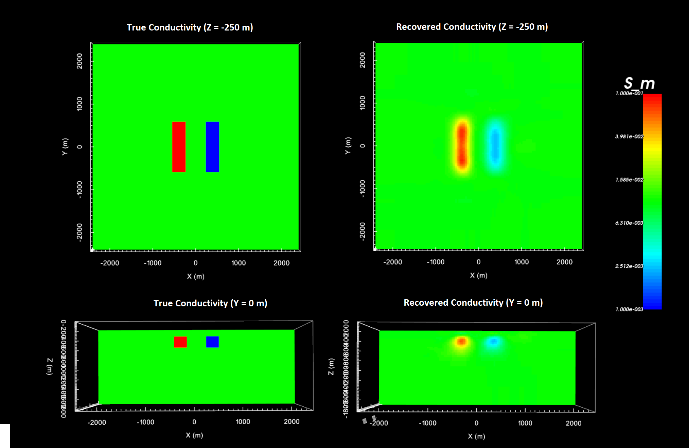

.. _example_dcinv:

DC Inversion
============

Here, we use the code **dcinv3d_55.exe** and the input file **dc_inv.inp** to recover a conductivity model. Because this is a simple example with no noise, we assigned a uncertainties of 1e-8 V + 1% to all DC data. In practice, data are noisy and choosing appropriate uncertainties is very important for successful inversion.

Before running the example, you may want to:

    - `Download and open the zip folder containing the entire DCIP3D v5.5 example <https://github.com/ubcgif/dcip3d/raw/master/assets/dcip3d_v5p5_example.zip>`__ (if not done already)
    - :ref:`Learn how to run code from command line <dc_inv>`
    - :ref:`Learn the format of the input file <dcip_input_dcinv>`

Files relevant to this part of the example are in the sub-folder *dc_inv*. To invert the synthetic data, the input file below (**dc_inv.inp**) was used. For formatting, :ref:`see format <dcip_input_dcinv>` :

.. figure:: ../inputfiles/images/create_dc_inv_input.png
     :align: center
     :width: 700

The true model (left) and the final recovered model (right) are shown below.

