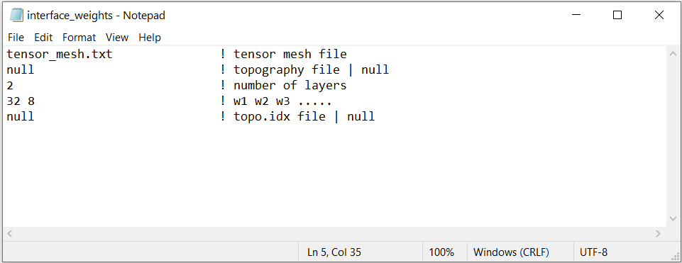

.. _example_weights:

Interface Weights
=================

Here, the code **make_wdat.exe** is used to create create near surface interface weights. Near surface interface weights can be used to reduce near-surface artifacts attributed to the high sensitivity of cells near electrodes. Before running this example, you may want to do the following:

	- `Download and open the zip folder containing the entire DCIP octree example <https://github.com/ubcgif/DCIPoctree/raw/master/assets/dcipoctree_example.zip>`__ (if not done already)
	- Learn how to run :ref:`make_wdat<dcip_model>`
	- Learn the format of the input file :ref:`interface_weights.inp<dcip_input_model>`

Files relevant to this part of the example are in the sub-folder *interface_weights*. To create the inteface weights, the input file below (**interface_weights.inp**) was used. For formatting, :ref:`see format <dcip_input_weights>` :

