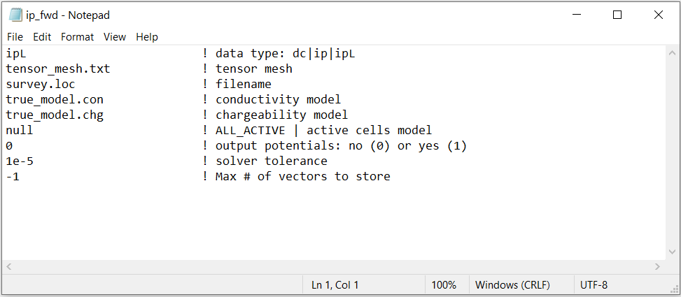
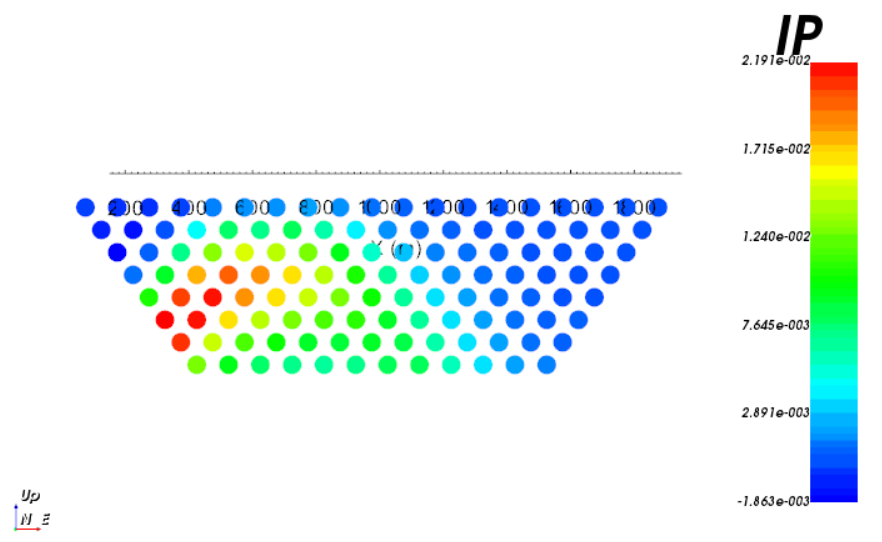

.. _example_ip_fwd:

IP Forward Modeling
===================

Here, the code **dcipf3d.exe** and the input file **ip_fwd.inp** (:ref:`see format <dcip_input_fwd>`) are used to forward model IP data along 9 pole-dipole profile lines oriented West to East. Files relevant to this part of the example are in the sub-folder *ip_fwd*. For this example, we use the chargeability model that was created in the example ":ref:`create model<example_model>`". Before running this example, you may want to do the following:

	- `Download and open the zip folder containing the entire DCIP3D v5.0 example <https://github.com/ubcgif/dcip3d/raw/master/assets/dcip3d_v5p5_example.zip>`__ (if not done already)
	- :ref:`Learn how to run code from command line <dcip_fwd>`
	- :ref:`Learn the format of the input file <dcip_input_fwd>`

To forward model the data, the following input file was used:

By choosing the *ipL* flag on the first line of the input file, we are using a linearized formulation for modeling IP data. The IP data type is defined in the survey file. Here, we set *IPTYPE=1* so that IP data are represented as apparent chargeabilities. Below, we show the 2D pseudo-section for data collected along profile line 5 (Northing = 0 m).

**Apparent Chargeability (V/V)**

