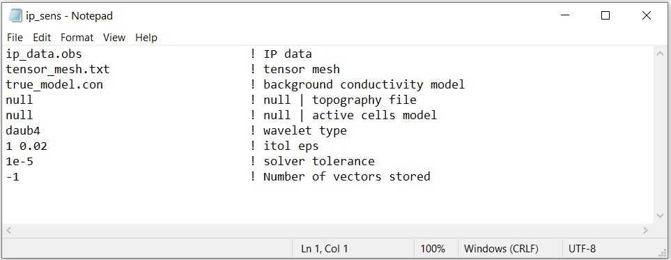
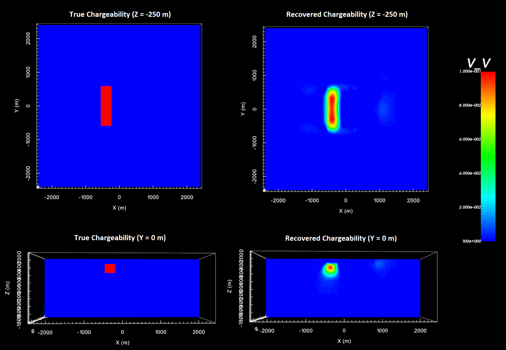

.. _example_ipinv:

IP Inversion
============

IP inversion is carried out in two parts. First, we must use the code **ipsens3d.exe** to construct the sensitivity matrix for the linearized IP problem. Then we use **ipinv3d.exe** to invert the IP data. Because this is a simple example with no noise, we assigned a uncertainties of 0.0005 to all IP data. In practice, data are noisy and choosing appropriate uncertainties is very important for successful inversion.

Sensitivity Matrix
------------------

Here, the code **ipsens3d.exe** and the input file **ip_sens.inp** (:ref:`see format <dcip_input_sens>`) are used to approximate the sensitivity matrix for the linearized IP problem. Files relevant to this part of the example are in the sub-folder *ip_sens* . Before running this example, you may want to do the following:

     - `Download and open the zip folder containing the entire DCIP octree example <https://github.com/ubcgif/DCIPoctree/raw/master/assets/dcipoctree_example.zip>`__ (if not done already)
     - :ref:`Learn how to run code from command line <dcip_sensitivity_weights>`
     - :ref:`Learn the format of the input file <dcip_input_sens>`

To compute the sensitivity matrix, the following input file was used:

IP Inversion
------------

Here we use the code **ipinv3d.exe** to recover a chargeability model. Before running this example, you may want to do the following:

    - `Download and open the zip folder containing the entire DCIP octree example <https://github.com/ubcgif/DCIPoctree/raw/master/assets/dcipoctree_example.zip>`__ (if not done already)
    - :ref:`Learn how to run code from command line <ip_inv>`
    - :ref:`Learn the format of the input file <dcip_input_ipinv>`

Files relevant to this part of the example are in the sub-folder *ip_inv*. To invert the synthetic data, the input file below (**ip_inv.inp**) was used. For formatting, :ref:`see format <dcip_input_ipinv>` :

.. figure:: ../inputfiles/images/create_ip_inv_input.png
     :align: center
     :width: 700

The true model (left) and the final recovered model (right) are shown below.

