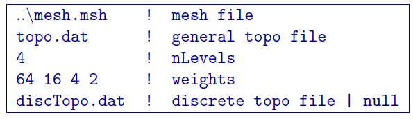
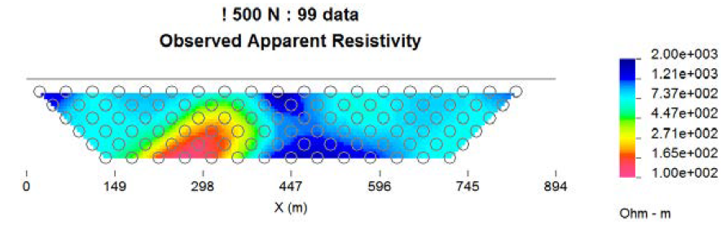
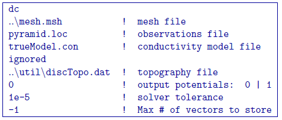

.. _example_legacy_dcfwd:

DC Forward Modeling
===================

As an example of DC forward modelling, we consider the pyramid model (Figure :numref:`dcmodel`). Using ``DCIPF3D``, the conductive prism buried beneath a topographic high is modelled for the DC data. A pole-dipole survey with 50-m dipoles with n = 1:5; 6:5 was simulated. In order to run the forward model in this case, we must first convert our topo.dat, which is a general topo file to the discrete format by using the ``MAKE_WDAT`` utility. The command for this is

.. code-block:: rst

    make_wdat changeTopo.inp

where ``changeTopo.inp`` is located in a folder labelled ``util`` was generated as

Since we will use the weighting file in an inversion example, we will go ahead and calculate weights for the top four layers of the model. If we were not interested in the weights, we could simply put n = 1 and use a value of 1.0. Then discard the file ``w.dat`` that has been created. The important step in this case is that the code has generated the discrete topography file ``discTopo.dat`` that will be used throughout the example.

        Forward modelled apparent resistivity for a line data across the center of the pyramid at 500 N for surface current locations only

Now, that we have our discretized topography, we can run the DC forward problem in the folder fwd with the command:

.. code-block:: rst

    dcipf3d dcFwd.inp

and the dcFwd.inp is:

where we have left the discrete topography in its ``util`` folder. Note that line 5 is ignored (the chargeability model), but something must be there. The file ``dc3d.dat`` is created (and will be over- written if a file of this name already exists). No log file is created for the forward modelling, but the process took less than 2 sec on a PC with an 3.2Ghz Intel i7 processor with 12 threads used for OpenMP. The apparent resistivity for a line data across the center of the pyramid is shown in Figure 7. Only surface current electrodes were used to create the pseudo-section.
