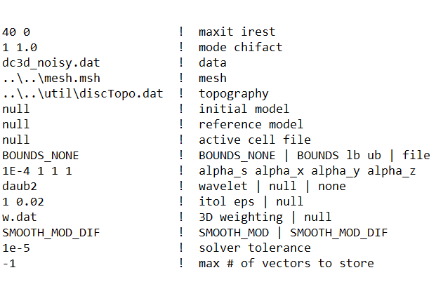
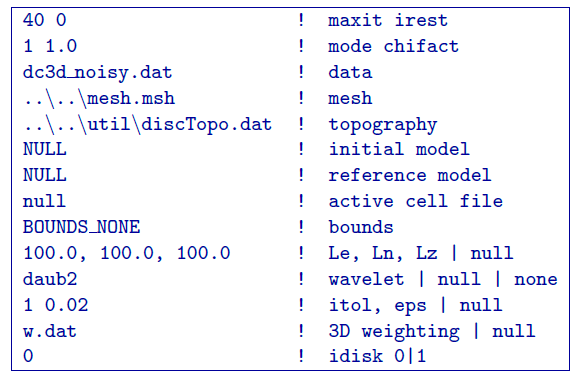
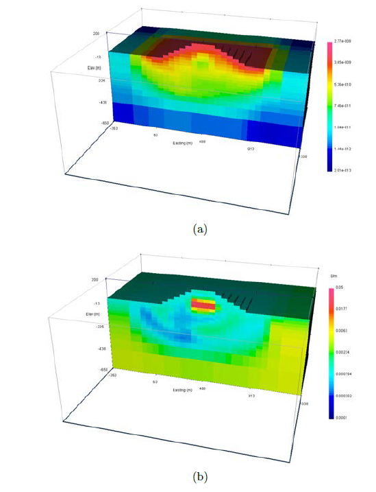
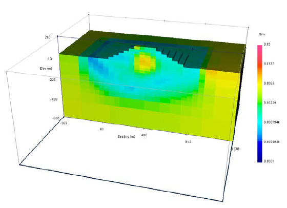

.. _example_legacy_dcinv:

DC Inversion
============

The data created in section 5.2.1 are contaminated with 5% Gaussian noise. The uncertainties are estimated at 5% and a  oor of 0.0001 Volts. In this case, we know the true datamisfit that should be achieved is near the number of data, therefore we select ``mode=1`` to have ``DCINV3D`` perform a line search to choose the appropriate trade-off parameter. The parameter will be 1.0 to signify 48 that the datamisfit is n number of data. The minimum file requirements for ``DCINV3D`` is just the data file. In this case, we will choose not to use bounds. However, we will use the w.dat that was created when discretizing the topography. We will cap the inversion at 40 iterations. We will use the default reference model (best fitting half-space) and initial model (same as the reference model). The inversion starts from scratch so ``irest=0`` is given. The new incorporation of bounds is useful in real-life situations where there is down-hole mea- surements that often have additional conductivity measurements from well logs. Soft constraints, such as the reference model and weighting file would attempt to enforce the values the geophysicist has chosen from the well log information (which would need to be discretized onto the mesh). The user could also use hard constraints on the inversion by incorporating bounds or by using a reference model in combination of an active cells file where the cells located along the borehole are inactive (i.e., set to 0 in the active file).

The inversion of the DC data is run by using the command

.. code-block:: rst

    dcinv3d dcinv.inp

For version 5.5 and later, the input file ``dcinv.inp`` looks like the following:

For versions before 5.5, the input file would look like (**version 5.0 was used to create this example**):

The inversion required 16 iterations to converge to the target misfit. A truncated copy of the log file that summarizes the inversion is shown in Figure 9. It gives the specifics at each iteration such as the number of threads used for OpenMP, the achieved data misfit, the model objective function value, the trade-off paramter, and the accuracy of the wavelet transform. The inversion itself only took a few minutes. The final data misfit was 1,521 for the 1,584 data. Figure :numref:`dcinvresult` a shows the average sensitivity for each cell from the output ``sensitivity.txt``. The recovered model is shown in Figure :numref:`dcinvresult` b.

For reference, the inversion is performed without the weighting file w.dat so that the next to last line on the input file is ``null``. The inversion converged in 12 iterations to the desired data misfit (again :math:`\approx 1500`). The recovered model is shown in Figure :numref:`dcinvresultnoweight` on the same scale as the inversion result with weighting. It has placed more conductive material at the surface so the main block is not as conductive.

.. figure:: ../../images/dcinvlog.png
        :name: dcinvlog
        :figwidth: 75%
        :align: center

        Truncated log file for ``DCINV3D`` showing the inputs of the inversion and specics at each iteration. The bottom tells the user that the code stopped because it converged to the desired misfit.

        Panel (a):The average sensitivities in the DC inversion written to the file ``sensitivity.txt``. Panel (b) The inversion result (dcinv3d.con) in S/m after 16 iterations.

        The inversion result (``dcinv3d.con``) in S/m after 12 iterations without the surface weight- ing file ``w.dat``. The colour scale is consistent with Figure :numref:`dcinvresult` b.

