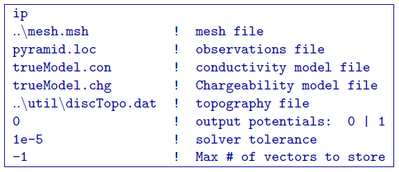
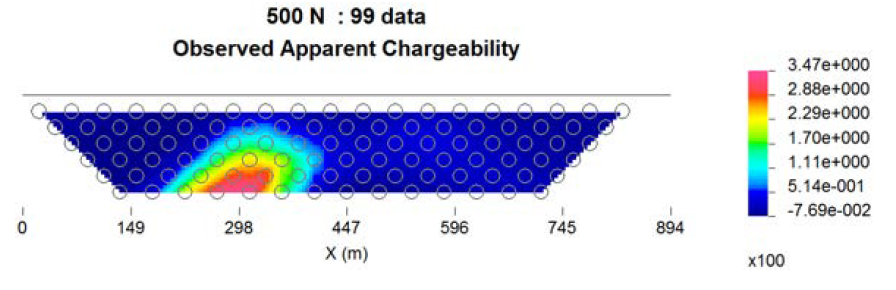

.. _example_legacy_ipfwd:

IP Forward Modeling
===================

As an example of DC forward modelling, we consider the pyramid model (Figure :numref:`ipmodel`). Using ``DCIPF3D``, the chargeable prism buried beneath a topographic high is modelled for the IP data. The same pole-dipole survey as the DC data with 50-m dipoles with n = 1:5; 6:5 was simulated. The locations file uses ``IPTYPE=1`` so that we forward model apparent chargeabilities. If the general topo file topo.dat has not been converted, then we must first do that because of the general locations file. See the previous section (section 5.2.1) for details. The topography conversion only needs to be done once for a locations or observations file and mesh. If either of those elements change, then a new discrete topography file should be generated. Now, that we have our discretized topography, we can run the IP forward problem in the folder fwd with the command

.. code-block:: rst

    dcipf3d ipFwd.inp

and the dcFwd.inp is:

where we have left the discrete topography in its ``util`` folder. The file ``ip3d.dat`` is created (and will be over-written if a file of this name already exists). No log file is created for the forward modelling, but the process took less than 4 sec on a PC with an 3.2Ghz Intel i7 processor with 12 threads used for OpenMP. The apparent resistivity for a line data across the center of the pyramid at 500 N is shown in Figure 8 using only the surface electrodes.

        Forward modelled apparent chargeability for a surface line data across the center of the pyramid.
