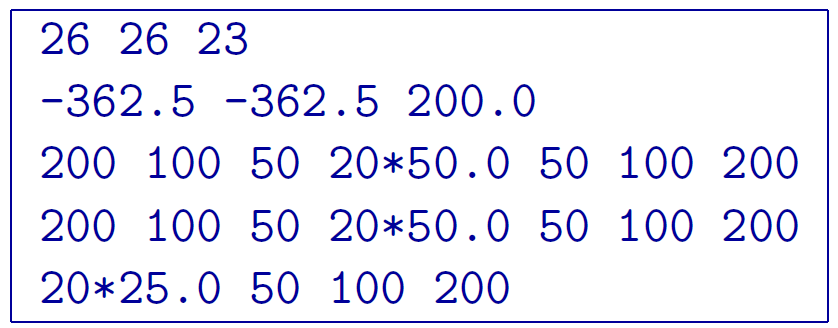

.. _examples:

Introduction
============

.. figure:: ../images/example_model_DC.png
        :name: dcmodel
        :align: center
        :figwidth: 50%

        Pyramid topographic model of a used for DC forward modelling and the inversion examples. The block is a :math:`10 \Omega m~(0.1 S/m)` block in a :math:`1000 \Omega m~(0.001 S/m)` half-space. The colour scale is in S/m. The electrode locations are shown in white.

.. figure:: ../images/example_model_IP.png
        :name: ipmodel
        :align: center
        :figwidth: 50%

        Pyramid topographic model of a used for IP forward modelling and the inversion examples. The intrinsic chargeability of the block is 0.15 and the background is not chargeable. The colour scale is in fractional percent chargeability. The electrode locations are shown in white.

In this section, we present forward modelling and inversion examples for both DC and IP data
types. The examples are freely available for download and can also be found on the DCIP3D
website (without the exe files). The example is synthetic and is a :math:`10 \Omega m~(0.1 S/m)` block in a :math:`1000 \Omega m~(0.001 S/m)` half-space with a pyramid-shaped topography (Figure 5). For added complexity, surface data on a 25-m grid is simulated along with borehole data so that the general data format is required. The intrinsic chargeability of the block is 0.15 (Figure 6). The electrode locations are denoted by the white dots in both Figures. After forward modelling, 5% Gaussian noise is added to each data set to create the \observed" data sets. The uncertainties assigned are 5% of each datum with a 0.0001 oor (for both DC and IP). The last section shows the differences between the old code and version 5.0 with respect to the nodal-based finite difference scheme (shown in Figure 3). The mesh used for the example is 26 X 26 X 23 and the file is given by

- `Download zip file for example <https://github.com/ubcgif/dcip3d/raw/master/example/dcip3dv5_example.zip>`__, which contains all the files necessary to run the forward and inverse problems.

.. toctree::
        :maxdepth: 2

        DC Forward Modeling <exeprism/dcfor>
        IP Forward Modeling <exeprism/ipfor>
        DC inversion <exeprism/dcinv>
        IP inversion <exeprism/ipinv>
        Version Comparison <exeprism/versioncomparison>
