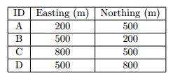

.. _examples:

Example using five prisms
=========================

The example model is comprised of five anomalous rectangular prisms embedded in a uniform halfspace. There are three surface prisms simulating near-surface distortions, and two buried prisms simulating deeper targets, as shown in the figure below.

.. figure:: ../images/example/5prisms.png
	:align: center
	:figwidth: 50%

The five blocks are assigned conductivity and chargeability values, which are given in the table below.

.. figure:: ../images/example/table1.PNG
	:align: center
	:figwidth: 75%

DC resistivity and IP data are forward modelled for both surface and cross-borehole arrays using the ``DCIPoctreeFwd`` code. Three different electrode configurations were used for both DC and IP data types to show the benefits of a joint inversion using both surface and borehole data. Details of the three surveys are as follows:

1. Surface dataset: Pole-dipole arrays with a = 50 m (smallest potential electrode spacing) and n (potential electrode position) ranging from 1 to 6. Eleven east-west lines with a line spacing of 100 m were used to cover the core region of the model which is 1 square km. In total, 1089 observations were forward modelled using 209 current electrodes.

2. Borehole dataset: Pole-dipole arrays located within 4 boreholes, whose locations are specified in the table below. The data were simulated using a borehole array configuration in which the current electrode is moved down each of the 4 boreholes with 25 m steps to the depth of 350 m. This results in a total of 51 current electrode locations. For each of the current electrode locations, the potential electrode array, with a 50 m spread, was placed in each of the remaining three boreholes and moved down to a depth of 350 m at 25 m intervals, resulting in 1530 forward modelled observations.

3. Combined surface and borehole dataset: A combination of the above pole-dipole surface and borehole arrays, resulting in 260 current electrodes and 2619 total forward modelled observations.

Prior to inversion, 5% Gaussian noise was added to the forward modelled data, and uncertainties were assigned to be 5% of the data value plus a small floor. 

The following pages describe the constant inversion parameters used and then the inversion of each dataset.

.. toctree::
        :numbered:
        :maxdepth: 2

        Inversion parameters <exe5prism/param>
        DC inversion of surface data <exe5prism/dcsurf>
        IP inversion of surface data <exe5prism/ipsurf>
        DC inversion of borehole data <exe5prism/dcbore>
        IP inversion of borehole data <exe5prism/ipbore>
        DC inversion of combined data <exe5prism/dccomb>
        IP inversion of combined data <exe5prism/ipcomb>

