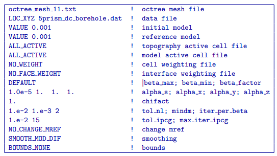
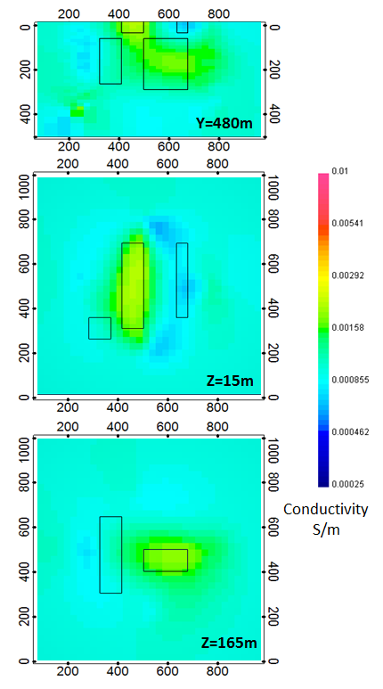

.. _dcbore:

DC inversion of borehole data
=============================

Since the DC inversion based on surface data (see :numref:`invdc`) did not resolve the anomalous blocks at depth very precisely, here we perform another inversion using data from 4 separate boreholes. The input control file for this inversion has the following form:  

This inversion converged after 15 beta iterations to a a final data misfit of 1499. The recovered model is shown in :numref:`invdcbh`. Within each of the sections presented, the black outlines show the location of the blocks within the true model. When compared with the inversion of DC surface data in :numref:invdc`, there is a significant decrease in resolution throughout the model and the amplitude of the recovered anomalies significantly under-estimates the conductivity contrast between the blocks and the background. 

The top panel of :numref:`invdcbh` shows a cross-section through the recovered model at Y = 480 m. Here, both of the surface blocks are visible but they lack sharp boundaries and the large conductive surface block has been smeared downwards to connect with the conductive block at depth. While there is a resistive anomaly in the vicinity of the deep resistive block, the recovered anomaly is shifted to the west.

The second panel from the top shows a depth slice through the model at a depth of 15 m. In this section, only the large surface conductive block is resolved. The small westernmost conductive surface block is not recovered at all, and the thin resistive surface block to the east has been highly distorted to form a chevron-like shape which points to the east. While the large surface conductive block is the best resolved surface block, it has still bled slightly into the background region surrounding the block and lacks sharp boundaries. 

The bottom panel of :numref:`invdcbh` shows another depth slice through the recovered model. This section cross-cuts the 2 deeper blocks at a depth of Z = 165 m. At this depth, the deep conductive block is recovered, but only a faint trace of resistive material is present to the west of the true location of the deep resistive block. Although the conductive anomaly is slightly larger than the true block, it is centered about the true location. As in the above panels, the recovered anomalies have very diffuse boundaries.

	The electrical conductivity model recovered from the inversion of DC borehole data. The position of the true blocks are indicated by the black outlines. When compared with the inversion result using the DC surface data (:numref:`invdc`), there is a general decrease in model resolution as a result of decreased sensitivities in region surrounding the blocks due to the borehole survey geometry. While the most significant decreases in the model resolution are seen in the near surface, this inversion result also does a very poor job of resolving the deep resistive block.