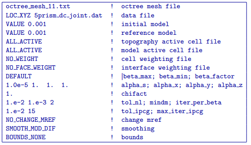
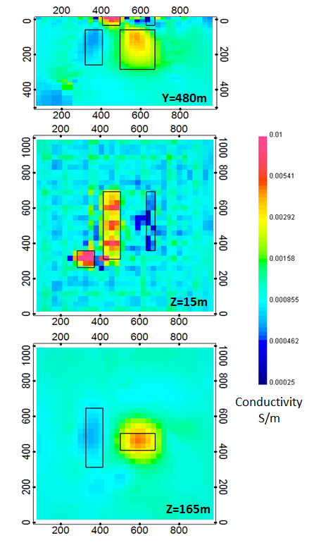

.. _dccomb:

DC inversion of combined surface and borehole data
==================================================

Since neither the surface or borehole DC data were able to adequately resolve all 5 blocks, a joint inversion was done using both data sets. The input control file for this inversion has the following form:

The inversion converged after 23 beta iterations to a final data misfit of 2452. The recovered model is shown in :numref:`incdcjn`. Within each of the sections presented, the black outlines show the location of the blocks in the true model. While there is not a substantial improvement in the near surface model resolution when compared to the DC surface data inversion (see :numref:`invdc`), the deeper conductive and resistive blocks are much better resolved. 

The top panel of :numref:`invdcjn` shows a cross section through the recovered model at Y = 480 m. In this view, the intersected conductive surface block is very well resolved, but the thinner resistive surface block is slightly obscured by near surface artifacts (more refined inversion models could be devised to remove or smooth out many of these near surface anomalies using cell and interface weighting). Although the general size and location of the deeper blocks is well constrained, they still lack sharp boundaries.

The second panel from the top shows a depth slice through the model at Z = 15 m. In this view, all 3 of the surface blocks are fairly well resolved. As should be expected, the conductive blocks are slightly better resolved than the resistive block. The boundaries of the resistive surface block are somewhat difficult to discern as a result of near surface artifacts, most of which appear to be more resistive than the background. 

The bottom panel of :numref:`invdcjn` shows another depth slice through the recovered model which cuts through the 2 deeper blocks at a depth of Z = 165 m. The recovered anomalies lack sharp outlines and have been slightly smeared to create circular and oval shaped anomalies. This joint DC inversion result does a far better job of resolving the deep blocks than either the DC surface or DC borehole data inversions (see :numref:`invdc` and :numref:`invdcbh`, respectively). The deep resistive block is still shifted slightly to the west in the recovered model, but its north-south location is better defined and the extent of the smearing is dramatically reduced.

	As anticipated, the recovered model from the joint inversion of surface and borehole DC data does the best job of resolving the location of all 5 of the blocks in the true synthetic model. The position of the true blocks are indicated by the black outlines. When compared with the inversion result of the DC surface data (see :numref:`invdc`), there is a significant increase in model resolution at depth due to the incorporation of the borehole data. The near surface model resolution does not appear to have changed significantly as a result of the joint inversion.