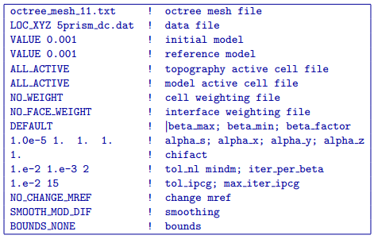
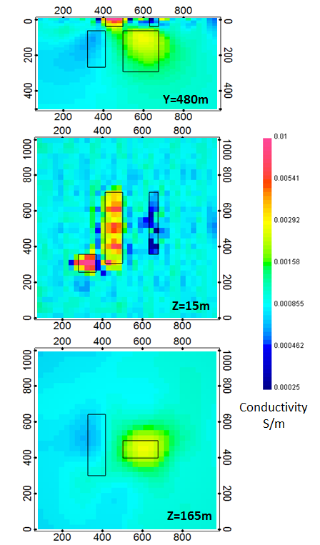

.. _dcsurf:

DC inversion of surface data
============================

The first inversion result, which uses only DC surface data, was carried out using the following input control file:

The inversion converged after 17 beta iterations to a final data misfit of 1656. The recovered model is shown in :numref:`invdc`. While the recovered model is quite similar to the true model, especially in the near surface regions, its ability to resolve the deeper blocks is clearly limited. Within each of the sections presented, the black outlines show the location of the blocks in the true model.

The top panel of :numref:`invdc` shows a cross section through the recovered model at Y = 480 m. In this view, the intersected conductive surface block is well resolved, but the thinner resistive surface block is slightly more difficult to pick out among the near surface artifacts (more refined inversion models could be devised to remove or smooth out many of these near surface anomalies using cell and interface weighting). While the presence of the deeper blocks is clearly visible in the top panel, the recovered anomalies are smeared out and lack definition.

The second panel from the top shows a depth slice through the model at a depth of 15 m. In this view, all 3 of the surface blocks are fairly well resolved. As should be expected, the conductive blocks are slightly better resolved than the resistive block. The boundaries of the resistive surface block are somewhat blurred by the presence of near surface artifacts (most of which appear to be more resistive than the background in this particular section). 

The bottom panel of :numref:`invdc` shows another depth slice through the recovered model. This section cross-cuts the 2 deeper blocks at a depth of Z = 165 m. As was observed in the top panel, the deeper blocks are clearly visible but somewhat diffuse in that they are spread over a region larger than that of the true block and lack sharp boundaries. In this section, the deep conductive block is much better resolved than the deep resistive block. Although the conductive anomaly is slightly larger than the true block, it is centered about the true location. In contrast, the deep resistive anomaly is shifted slightly to the west and north of the true block location and is smeared out extensively towards the western edge of the model. As a result of the resistive anomaly's larger size, there is less of a physical property contrast between the anomaly and the background. For this type of surface data, the observed decrease in model resolution at depth is anticipated, since we have a limited separation between current and potential electrodes. 

	The conductivity model recovered from inversion of surface data. Each of the panels shows a different section through the recovered model. The top panel shows a cross section along Y = 480 m, the middle panel is a depth section from a depth of Z = 15 m, and the bottom panel shows a second depth section from Z = 165 m. The positions of the true prisms are indicated by the black outlines within each model section. While the surface blocks are nicely resolved by the inversion, the deeper blocks only show up as diffuse anomalies whose shape, spatial location, and physical property contrast with the background are not very well defined
