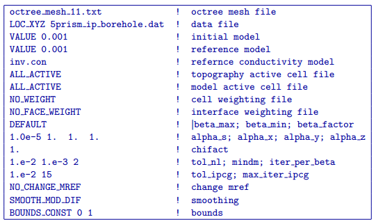
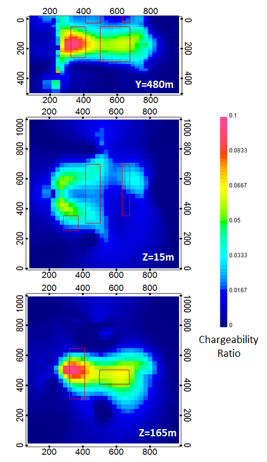

.. _ipbore:

IP inversion of borehole data
=============================

Using the same survey geometry as in DC borehole data inversion (:numref:`invdcbh`), an IP inversion was also done to see how well we could resolve the 5 chargeable blocks. Below is the input control file that was used for this IP inversion.

As in the previous IP inversion, the sensitivity was calculated using the conductivity model recovered from the corresponding DC inversion (i.e., DC borehole inversion, see :numref:`invdcbh`) and upper and lower bounds were set to 0 and 1 respectively to enforce a positivity constraint on the recovered chargeability.

This inversion converged after 27 beta iterations to a a final data misfit of 1520. The recovered model is shown in :numref:`invipbh`. Within each of the sections presented, the red outlines show the location of the blocks in the true model. Although the recovered model does a fair job of resolving the deep chargeable blocks, it is unable to recover any of the surface blocks. 

The top panel of :numref:`invipbh` shows a cross section through the recovered model at Y = 480 m. In this view, a high chargeability anomaly is centered at depth around the 2 deep blocks, but extensive smearing is visible in both lateral and vertical directions. The region of highest chargeability is centered about the eastern deep chargeable block. This anomaly has been smeared laterally to the east so that it connects with the other deep chargeable block and vertically up to the surface. It does not appear as though any of the surface blocks have been recovered. 

The middle panel shows a depth slice through the model at a depth of 15 m. This section shows to inability of this inversion result to resolve any of the surface blocks. Based on the location and shape of the high chargeability anomaly visible in this section, it appears as though this anomaly is an artifact of the inversion produced by the vertical smearing of the deep chargeable blocks up to the surface. As one would expect with the borehole data, the near surface sensitivities are very small when contrasted with the surface data IP inversion (see :numref:`invip`).

The bottom panel of :numref:`invipbh` shows another depth slice through the recovered model which cuts the 2 deeper blocks at a depth of Z = 165 m. As was observed in the top panel, the deeper blocks have been smeared together to form a single diffuse anomaly with a region of higher chargeability centered around the western block. From this inversion result, it is very difficult to tell that the true model contained 2 separate chargeable blocks at depth. The fact that the deep western chargeable block in the recovered model has a higher chargeability than the eastern block must be a result of the north-south orientation of the western block and its proximity to the boreholes since both deep blocks have the same chargeability.

	The chargeability model recovered from inversion of surface data shown using 3 different section views which transect the 5 chargeable blocks in the true model. The top panel shows a cross section along Y = 480 m, while the middle panel shows a depth section at of Z = 15 m, and the bottom panel shows a second depth section from Z = 165 m. The positions of the true prisms are indicated by the red outlines within each model section. The conductivity from the DC borehole data inversion (see :numref:`invdcbh`) was used to calculate sensitivities. The depth resolution of this model has significantly increased compared to the surface data inversion (:numref:`invip`), however this was done at the expense of the near surface resolution.