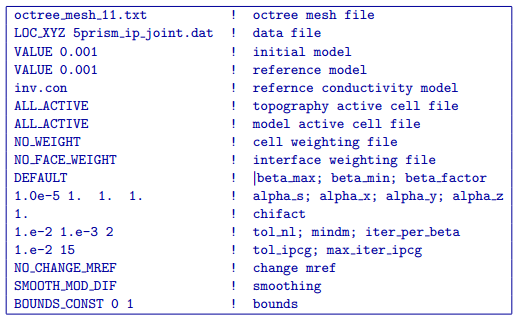

.. _ipcomb:

IP inversion of combined surface and borehole data
==================================================

To see if a joint inversion of the surface and borehole IP data would help to better resolve the chargeable blocks in the true model, this final inversion was run using the following input control file:

As in the previous IP inversions, the sensitivity was calculated using the conductivity model recovered from the corresponding DC inversion (i.e. DC joint inversion, see :numref:`invdcjn`) and upper and lower bounds were set to 0 and 1 respectively to enforce a positivity constraint on the recovered chargeability.

This IP inversion converged after 27 beta iterations to a a final data misfit of 2568. The recovered model is shown in :numref:`invipjn`. Within each of the sections presented, the red outlines show the location of the blocks in the true model. The recovered  model offers a good representation of the overall chargeability distribution, and does the best job of resolving the 5 chargeable blocks contained within the true synthetic model. Despite the significant improvements in model resolution at depth, the recovered model from the joint IP inversion is still incapable of distinguishing the two deep blocks. 

The top panel of :numref:`invipjn` shows a cross section through the recovered model at Y = 480 m. Here, both of the surface blocks are reasonably well resolved. While the vertical extent of the deeper blocks is clearly defined, the recovered anomalies are smeared together into a single anomaly at depth. While some vertical smearing is also present between the large surface block and the conductive anomaly at depth, the vertical smearing is not nearly as pervasive as it was in the surface or borehole IP inversions (see :numref:`invip` and :numref:`invipbh`, respectively). In this inversion result, it is also possible to discern that the deeper blocks are more chargeable than the surface blocks, while the surface IP inversion indicated the opposite.

The middle panel shows a depth slice through the model at a depth of Z = 15 m. In this view, all 3 of the surface blocks are well resolved. The response from the easternmost chargeable surface block is smaller than the other surface blocks because it is thinner. When compared with the IP inversion of surface data (see :numref:`invip`), the near surface artifacts in the IP inversion are lower in amplitude, making it easier to resolve all three surface blocks. Surface interface weighting could be easily applied to remove some of the near surface anomalies and potentially sharpen the recovered surface block boundaries.

The bottom panel of :numref:`invipjn` shows another depth slice through the recovered model. This section cross-cuts the 2 deeper blocks at a depth of Z = 165 m. As was observed in the top panel, the deeper blocks have been smeared together to form a single anomaly whose vertical extent is fairly well defined. Although the joint surface and borehole IP data inversion was still unable to resolve the 2 chargeable blocks at depth, it still produces the chargeabilty model which is the most similar to the true model. 

.. figure:: ../../images/example/InvIP_JN.png
	:align: center
	:figwidth: 50%
	:name: invipjn

	The chargeability model recovered from the joint inversion of surface and borehole IP data is shown using 3 different section views which transect the 5 chargeable blocks in the true model. The top panel shows a cross section along Y = 480 m, while the middle panel shows a depth section at of Z = 15 m, and the bottom panel shows a second depth section from Z = 165 m. The positions of the true prisms are indicated by the red outlines within each model section. The conductivity from the joint DC data inversion (see :numref:`invdcjn`) was used to calculate sensitivities. Significant improvements in the model resolution (both in the near surface and at depth) are apparent when the joint IP data inversion result is compared with the result from the surface or borehole IP data inversions.