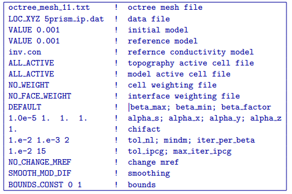

.. _ipsurf:

IP inversion of surface data
============================

The following IP inversion result was derived using the same surface electrode array as the previous DC inversion to recover a chargeability model of the subsurface. The input control file for this inversion has the following form:

Primary differences between this inversion and the previous surface data inversion that was performed using DC data are restricted to the reference model and bound constraints. For the IP surface data inversion, a uniform halfspace with a chargeability of 0.0001 (near-zero) is used for the reference model and the sensitivity calculation was done using the recovered conductivity model from the DC surface data inversion (see :numref:`invdc`). While no bound constraints were applied in the DC surface data inversion, a positivity constraint is applied for all of the IP inversions presented here. Constant bounds were set in the input file (BOUNDS_CONST 0 1), setting the lower bound to zero and upper bound to 1, to prevent the recovered chargeability values from being negative.

The IP surface data inversion converged after 6 beta iterations to a final data misfit of 1301. The recovered model is shown in :numref:`invip`. While the recovered  model offers a good representation of the large scale chargeability distribution, many of the details are lost. Within each of the sections presented, the red outlines show the location of the blocks in the true model. 

The top panel of :numref:`invip` shows a cross section through the recovered model at Y = 480 m. In this view, the wider of the 2 intersected surface blocks is well resolved, while the thinner chargeable surface block is slightly more difficult to resolve. Although the presence of the deeper blocks is clearly visible in the top panel, the recovered anomalies are smeared together into a single anomaly at depth which appears to connect with the chargeable surface anomalies. Despite the fact that the deeper blocks are more chargeable than the surface blocks, the inversion result indicates the opposite as a result of the larger near surface sensitivities.

The middle panel shows a depth slice through the model at a depth of 15 m. In this view, all 3 of the surface blocks are well resolved. The response from the eastern most chargeable surface block is fainter than the other surface blocks because it is thinner. When compared with the DC inversion of surface data (see :numref:`invdc`), the near surface artifacts in the IP inversion are lower in amplitude, making it easier to resolve all three surface blocks. 

The bottom panel of :numref:`invip` shows another depth slice through the recovered model which cuts through the 2 deeper blocks at a depth of Z = 165 m. As was observed in the top panel, the deeper blocks have been smeared together to form a single diffuse anomaly. From this inversion result, it is impossible to tell that the true model contained 2 separate chargeable blocks at depth. This result clearly illustrates that surface data alone is not capable of accurately resolving the chargeable bodies at depth. 

.. figure:: ../../images/example/InvIP.png
	:align: center
	:figwidth: 50%
	:name: invip

	The chargeability model recovered from inversion of surface data shown using 3 different section views which transect the 5 chargeable blocks in the true model. The top panel shows a cross section along Y = 480 m, while the middle panel shows a depth section at of Z = 15 m, and the bottom panel shows a second depth section from Z = 165 m. The positions of the true blocks are indicated by the red outlines within each model section. While the surface blocks are nicely resolved by the inversion, the deeper blocks only show up as a single diffuse anomaly. In addition to the lateral smearing of the chargeable blocks at depth, vertical smearing has also connected the shallow chargeable blocks with those at depth indicating that the resolution of the model decays rapidly with depth.