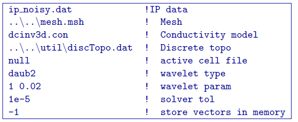
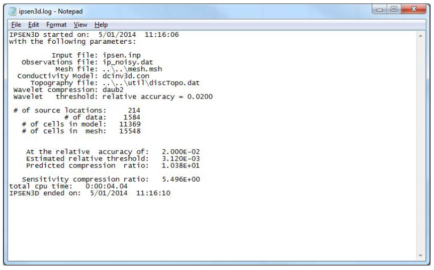
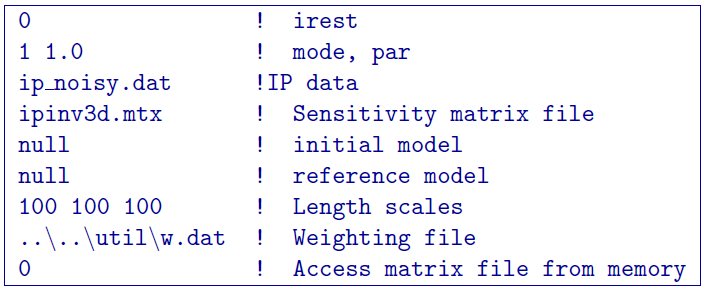
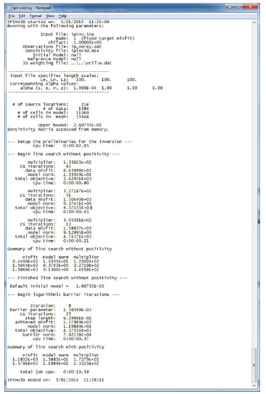
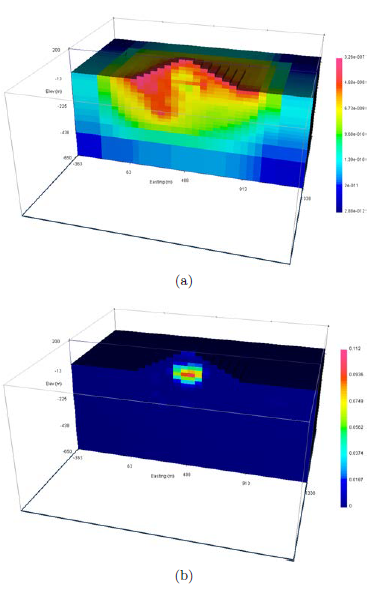
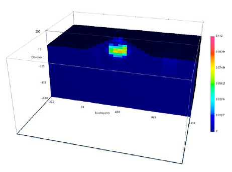

.. _ipinv:

IP Inversion
============
The data created in section 5.2 are contaminated with 5% Gaussian noise. The uncertainties are estimated at 5% and a floor of 0.0001. We first must create the sensitivity matrix by running ``IPSEN3D``. This is done via the command line:

.. code-block:: rst

        ipsen3d ipsen.inp

and the sensitivity input file, ``ipsen.inp`` is

and where in this case the conductivity model ``dcinv3d.con`` is the result of the inversion of DC datausing the surface weighting (it has been copied to the IP inversion folder). The result of running the code is the creation of its log file, ipsen3d.log (Figure :numref:`ipsenlog`), the sensitivity matrix required for the inversion, ``ipinv3d.mtx``, and the average sensitivities for the mesh, ``sensitivity.txt``. NOTE: the latter will be written over if the IP inversion is performed in the same folder as the DC inversion. The average sensitivities are presented in Figure :numref:`ipinvresult` a.

As with the DC, we know the true data misfit that should be achieved is near the number of data, therefore we select ``mode=1`` to have ``IPINV3D`` perform a line search to choose the appropriate trade-off parameter. We use the same length scales as the DC and will use the weight file w.dat as well. The initial model is set to ``null`` as well as the reference model. The program internally sets the initial model to 0.01 and the reference model to 0. The property ``idisk`` is set to 0 because the computer can handle storing the sensitivities is memory (this will be true in 99% of cases). The inversion is run by using the command:

.. code-block:: rst

        ipinv3d ipinv.inp

where the input file ipinv.inp is

The inversion finished in 2 iterations with a data misfit of 1579. The first iteration required 13 log barrier iterations and the second required 8. A truncated version of the log file produced is shown in Figure 13, which gives the input file information, log barrier parameters, and CPU time. The recovered model is presented in Figure :numref:`ipinvresult` b and recovers the block with a maximum chargeability of 0.11 (the true chargeability was 0.15).

As with the DC, the inversion is again run without the weighting file so that the next to last
line on the input file is ``null``. The inversion converged in 2 iterations to the desired data misfit (again :math:`\approx 1500`). The recovered model is shown in Figure :numref:`ipinvresultnoweight` on the same scale as the inversion result with weighting. Although not as stark in contrast as the DC, the model without weighting has a smaller chargeability at the location of the block and places slightly chargeable material at the surface.

        The truncated log file for ``IPINV3D`` showing the inputs of the inversion and specifics at each iteration. The bottom tells the user that the code stopped because it converged to the desired misfit.

        Panel (a) The average sensitivities in the IP inversion written to the file ``sensitivity.txt``. Panel (b) The inversion result (``ipinv3d.chg``) in fractional percent. The inversion required 2 log-barrier iterations.

        The inversion result (``ipinv3d.chg``) after 2 iterations without the surface weighting file ``w.dat``. The color scale is consistent with Figure :numref:`ipinvresult`.

