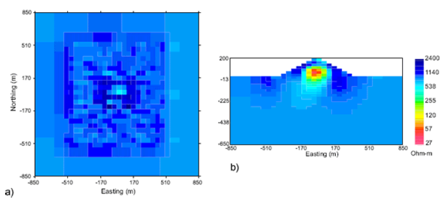
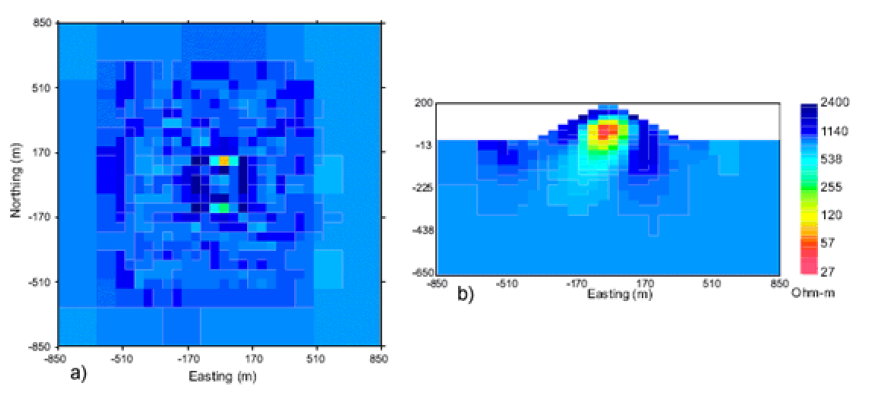
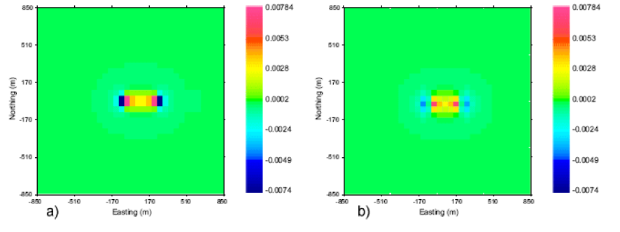

.. _versioncomparison:

Version comparison
==================

In this section, we compare the differences between the original version and this current version of ``DCIP3D`` that allows arbitrary electrode locations. For consistency, we use pyramid model from the Forward modeling and Inversion examples section in this document. The noise and survey design added will be consistent with the previous example, however, we will only examine the surface DC data. The important changes for the current version are concerned with optimizing numerical computations. The major items include: no longer having to store the sensitivity matrix ``dcinv3d.mtx``, and optimizing the way in which reciprocity is used in developing the sensitivity matrix. Generally, if the same electrode location is used more than once in a data file, its solution is stored for future use. These changes have no impact upon the final solution obtained by the inversion algorithm. Discussion of these, and some additional minor changes, are incorporated in the revised manual. In what follows, we focus upon the major implications of having the electrodes off of the nodal positions.

Forward modelling
-----------------

Figure :numref:`dcmodel` shows a volume-rendered image that will be forward modeled. A pole-dipole survey with 50-m dipoles was simulated and the apparent resistivity for a line data across the center of the pyramid is captured. Figure 16a shows the result with current electrodes in the centers of cells. It is to be compared with 16b where the currents are at nodes. The two pseudosections are very similar. Difference occur primarily because the experiments are not identical. The pole-dipole data in Figure :numref:`comparisonpseudosections` a correspond to n = 1:5; 6:5 while in Figure :numref:`comparisonpseudosections` b the data are n = 1; 6: It can be seen that the two pseudosections are slightly shifted vertically with respect to each other, which should be the case.

.. figure:: ../../images/comparison_pseudosections.png
        :name: comparisonpseudosections
        :figwidth: 75%
        :align: center

        The forward modeled pseudosection with electrodes on (a) nodes and (b) cell centers.

Inversion
---------

The data are inverted with ``DCIP3D v5.0`` and a plot of the resistivities of the surface cells, and a cross-section of the recovered model, are shown in Figure :numref:`figure17`. One characteristic of the inversion, irrespective of whether currents are on or off the nodes is that the model exhibits rough structure at the surface (or more generally, at current and potential electrode locations). The reason for this lies in the sensitivity values. The sensitivities for the DC resistivity (or IP problem) are highest at the location of an electrode (either a current or potential electrode). Changing the conductivity at a location closest to the electrode makes the greatest change in the measured datum and hence that is the preferential location to add conductivity. This effect is well understood and a number of GIF software programs have incorporated ways to ameliorate this \electrode" artifact, including the weighting file created from MAKE WDAT. For reference, Figure :numref:`figure18` is the inversion from the previous versions of ``DCIP3D`` that use the nodal discretization.

In Figure :numref:`figure19` a, a we plot the sensitivity due to a current at a nodal location and for a potential field value at a distance of 300 m from the current. This is a rough function which exhibits sign changes at the location of both electrodes. In the inverse problem the conductivity perturbation is made up of a linear combination of these sensitivities. This is one of the fundamental reasons why the first layer of surface cells often has considerable \chatter." We distribute the true current amongst neighboring electrodes and hence there is a superposition of the sensitivities shown in Figure :numref:`figure19` a. In the case that the true current is in the center of the cell the sensitivity due to the modelled distributed currents, is that shown in Figure :numref:`figure19` b.

        Inversion of the pyramid model (a) on the surface and (b) slice through the middle of the anomaly. Both current and potential electrodes are placed at cell centers.

        Inversion of the pyramid model (a) on the surface and (b) slice through the middle of the anomaly. Both current and potential electrodes are placed at cell nodes.

        Sensitivities calculated from the pyramid example by placing the current electrodes at (a) the cell nodes and at (b) the cell centers.
