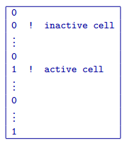

.. _activeFile:

Active cells file
=================

This file is optional. It has the exact same format as the :ref:`model file <modelFile>`, and thus must be the same size. 

The active cells file contains information about the cells that will be incorporated into the inversion. There are two basic types of active cell files: topography active cell file and model active cell file. 

#. The topography active cell file defines which cells within the model fall above the topographic surface. By default, all cells below the earth's surface are active (set to ``1``) and incorporated into the inversion while the air cells will be marked as inactive (set to ``0``) and excluded from the inversion. 

#. The model active cell file can be used to make additional cells, which lie beneath the topographic surface, inactive. In doing this, the inactive cells are fixed to their corresponding value in the reference model. Inactive cells are set to ``0`` while active cells are set to ``1``. Any inactive cells will not influence the minimization of the model objective function.

If no active cells are used in the forward modelling or inversion, the flag ``ALL_ACTIVE`` is used in the input files.

The following is an example of an active cells file:

