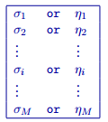

.. _modelfile:

Model file
==========

This file contains the cell values of the conductivity or chargeability model. The conductivity must have values in S/m, while chargeability is often unitless. Inversion models (forward, initial, reference, and recovered) are in this format. The following is the file structure of the model file:

:math:`\sigma_{i}`
        Conductivity of the :math:`i^th` cell. The conductivity is always in S/m. There are no a priori bound constraints set on the recovered conductivity model unless specific bound constraints are applied by the user.

:math:`\eta_{i}`
        Chargeability of the :math:`i^th` cell. The chargeability is typically unitless. Since chargeability ranges between [0,1), a positivity constraint should be applied.

:math:`M`
        The total number of cells in the model and its associated mesh (either octree or tensor).

