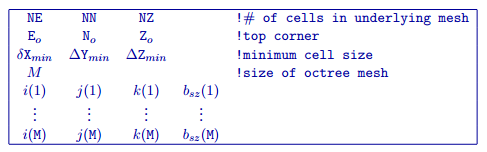

.. _octreemeshfile:

Octree mesh file
================

This file contains the 3D octree mesh, for example ``octree_mesh.msh``, which defines the model region. Each octree mesh is defined by the underlying (base) mesh, the coordinates of the southwest top corner, the smallest cell size in each direction, and the actual number of cells in the mesh (dependent on the degree of octree refinement, always smaller or equal to the number of cells in the base mesh). Octree mesh files have the following structure:

:math:`NE`
        Maximum number of base mesh cells in the east direction if the mesh were evenly divided into cells of width, :math:`\Delta X_{min}`.

:math:`NN`
        Maximum number of cells in the north direction if the mesh were evenly divived into cells of width,  :math:`\Delta Y_{min}`.

:math:`NZ`
        Maximum number of cells in the vertical direction if the mesh were evenly divived into cells of thickness, :math:`\Delta X_{min}`.

:math:`E_o N_o Z_o`
        Coordinates, in metres, of the southwest top corner, specified in (Easting, Northing, Elevation). The elevation can be relative to a reference elevation other than the sea level, but it needs to be consistent with the elevation used to specify the locations, observations, and topography files (see the relevant file descriptions).

:math:`\Delta X_{min}`
        Minimum cell width in the easting (X) direction.

:math:`\Delta Y_{min}`
        Minimum cell width in the northing (Y) direction.

:math:`\Delta Z_{min}`
        Minimum cell thickness (minimum vertical extent).

:math:`M`
        Actual number of discrete cells after merging of base mesh cells into octree mesh. :math:`M` defines how many cells participate in modelling/inversion, and is always less than or equal to the number of cells in the base mesh.

:math:`i` 
        :math:`i^{th}` Physical index of the current cell/block (ordered W to E).

:math:`j`
        :math:`j^{th}` Physical index of the current cell/block (ordered S to N).

:math:`k`
        :math:`k^{th}` Physical index of the current cell/block (ordered top to bottom).

:math:`b_{sz}`
        Size, in each direction, of the current cell/block with indecies (i,j,k). The volume of the cell/block would be :math:`(\Delta X_{min}*b_{sz})*(\Delta Y_{min}*b_{sz})*(\Delta Z_{min}*b_{sz})`. 

The mesh should be designed by considering it to consist of a core portion, representing the region of interest, and a padding zone, which ensures that the boundary conditions in the modelling are handled correctly. In the core portion, the size of the smallest cell in the mesh is controlled by the location of current/potential electrodes, the locations of the boreholes, and topography. The selection of the smallest cell for the underlying (base) mesh and the padding distance in each direction is set by the user in the input file for the ultility ``create_octree_mesh``, which is discussed in detail :ref:`here <createoctreemesh>`.

In the presence of surface topography, the top of the octree mesh corresponds to the highest point on the surface (see :ref:`topography file description <topofile>`).

Example of an octree mesh file
------------------------------

This example shows an octree mesh that is based off of an underlying mesh with 128 cells in both horizontal directions and 64 cells in the vertical direction. The smallest cells in the core portion of the mesh are 25m by 25m by 15m. Following the octree selective mesh refinement process the resulting mesh contains a total of 46,533 cells. The top south-west corner of the mesh has an elevation of 200m and has (x,y) coordinates of (-1064.5m,-1089.5m). 

.. figure:: ../../images/octreemeshexample.PNG
        :figwidth: 75%
        :align: center
