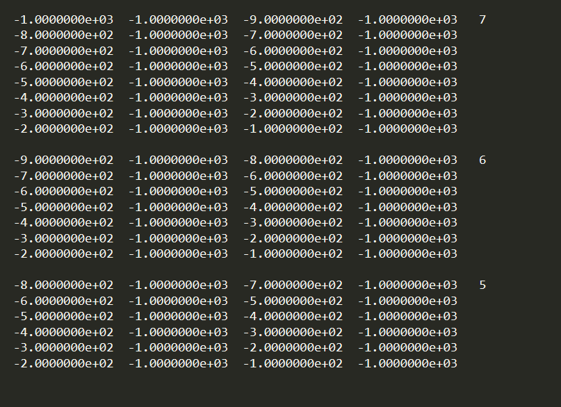
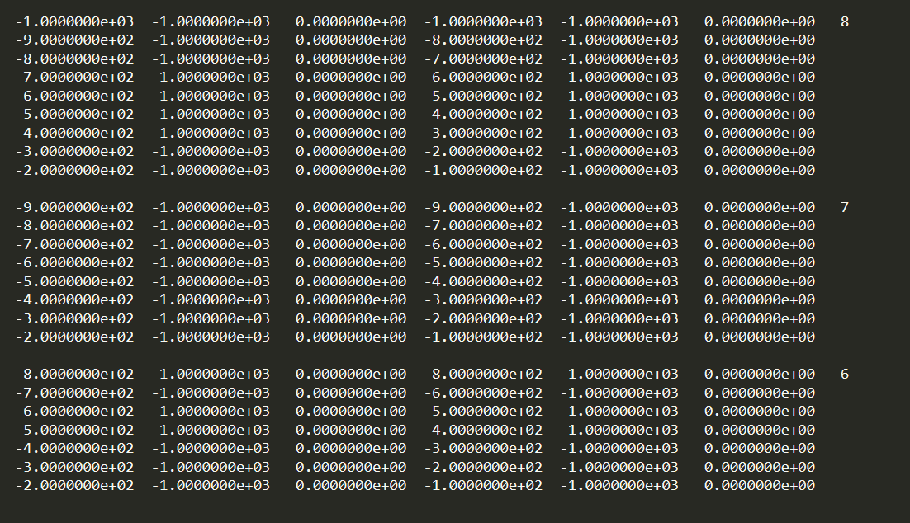

.. _surveyFile:

Survey File
===========

Survey files provide the survey information for predicting data with **dcipoctree_fwd.exe**. Whether DC and/or IP are being simulated, the format is the same. The general format for predicted data files is shown below.

.. note:: The *[   ]* brackets are used for columns are not always required. For example, the *Z* value for surface data with flat topography.

|
| [IPTYPE=1,2]
|
| :math:`\;\;\;X_A(1) \;\;\;\;\;\;\;\;\; Y_A(1) \;\;\;\;\;\;\;\;\, [Z_A(1)] \;\;\;\;\;\;\;\; X_B(1) \;\;\;\;\;\;\;\; Y_B(1) \;\;\;\;\;\;\;\;\; [Z_B(1)] \;\;\;\;\;\;\;\;\;\;\; N`
| :math:`\;X_M(1,2) \;\;\;\; Y_M(1,2) \;\;\;\;\, [Z_M(1,2)] \;\;\;\;\, X_N(1,2) \;\;\;\;\, Y_N(1,2) \;\;\;\;\, [Z_N(1,2)]`
| :math:`\;X_M(1,1) \;\;\;\; Y_M(1,1) \;\;\;\;\, [Z_M(1,1)] \;\;\;\;\, X_N(1,1) \;\;\;\;\, Y_N(1,1) \;\;\;\;\, [Z_N(1,1)]`
| :math:`\;X_M(1,3) \;\;\;\; Y_M(1,3) \;\;\;\;\, [Z_M(1,3)] \;\;\;\;\, X_N(1,3) \;\;\;\;\, Y_N(1,3) \;\;\;\;\, [Z_N(1,3)]`
| :math:`\;\;\;\;\;\;\;\;\;\vdots\;\;\;\;\;\;\;\;\;\;\;\;\;\;\;\vdots\;\;\;\;\;\;\;\;\;\;\;\;\;\;\;\;\;\;\vdots\;\;\;\;\;\;\;\;\;\;\;\;\;\;\;\;\;\;\;\vdots\;\;\;\;\;\;\;\;\;\;\;\;\;\;\;\;\;\vdots\;\;\;\;\;\;\;\;\;\;\;\;\;\;\;\;\;\vdots`
| :math:`X_M(1,N) \;\;\; Y_M(1,N) \;\;\; [Z_M(1,N)] \;\;\; X_N(1,N) \;\;\; Y_N(1,N) \;\;\; [Z_N(1,N)]`
|
| :math:`\;\;\;X_A(2) \;\;\;\;\;\;\;\;\; Y_A(2) \;\;\;\;\;\;\;\;\, [Z_A(2)] \;\;\;\;\;\;\;\; X_B(2) \;\;\;\;\;\;\;\; Y_B(2) \;\;\;\;\;\;\;\;\; [Z_B(2)] \;\;\;\;\;\;\;\;\;\;\; N`
| :math:`\;X_M(2,2) \;\;\;\; Y_M(2,2) \;\;\;\;\, [Z_M(2,2)] \;\;\;\;\, X_N(2,2) \;\;\;\;\, Y_N(2,2) \;\;\;\;\, [Z_N(2,2)]`
| :math:`\;X_M(2,1) \;\;\;\; Y_M(2,1) \;\;\;\;\, [Z_M(2,1)] \;\;\;\;\, X_N(2,1) \;\;\;\;\, Y_N(2,1) \;\;\;\;\, [Z_N(2,1)]`
| :math:`\;X_M(2,3) \;\;\;\; Y_M(2,3) \;\;\;\;\, [Z_M(2,3)] \;\;\;\;\, X_N(2,3) \;\;\;\;\, Y_N(2,3) \;\;\;\;\, [Z_N(2,3)]`
| :math:`\;\;\;\;\;\;\;\;\;\vdots\;\;\;\;\;\;\;\;\;\;\;\;\;\;\;\vdots\;\;\;\;\;\;\;\;\;\;\;\;\;\;\;\;\;\;\vdots\;\;\;\;\;\;\;\;\;\;\;\;\;\;\;\;\;\;\;\vdots\;\;\;\;\;\;\;\;\;\;\;\;\;\;\;\;\;\vdots\;\;\;\;\;\;\;\;\;\;\;\;\;\;\;\;\;\vdots`
| :math:`X_M(2,N) \;\;\; Y_M(2,N) \;\;\; [Z_M(2,N)] \;\;\; X_N(2,N) \;\;\; Y_N(2,N) \;\;\; [Z_N(2,N)]`
|
| :math:`\;\;\;\;\;\;\;\;\;\vdots\;\;\;\;\;\;\;\;\;\;\;\;\;\;\;\vdots\;\;\;\;\;\;\;\;\;\;\;\;\;\;\;\;\;\;\vdots\;\;\;\;\;\;\;\;\;\;\;\;\;\;\;\;\;\;\;\vdots\;\;\;\;\;\;\;\;\;\;\;\;\;\;\;\;\;\vdots\;\;\;\;\;\;\;\;\;\;\;\;\;\;\;\;\;\vdots`
| :math:`\;\;\;\;\;\;\;\;\;\vdots\;\;\;\;\;\;\;\;\;\;\;\;\;\;\;\vdots\;\;\;\;\;\;\;\;\;\;\;\;\;\;\;\;\;\;\vdots\;\;\;\;\;\;\;\;\;\;\;\;\;\;\;\;\;\;\;\vdots\;\;\;\;\;\;\;\;\;\;\;\;\;\;\;\;\;\vdots\;\;\;\;\;\;\;\;\;\;\;\;\;\;\;\;\;\vdots`
| :math:`\;\;\;\;\;\;\;\;\;\vdots\;\;\;\;\;\;\;\;\;\;\;\;\;\;\;\vdots\;\;\;\;\;\;\;\;\;\;\;\;\;\;\;\;\;\;\vdots\;\;\;\;\;\;\;\;\;\;\;\;\;\;\;\;\;\;\;\vdots\;\;\;\;\;\;\;\;\;\;\;\;\;\;\;\;\;\vdots\;\;\;\;\;\;\;\;\;\;\;\;\;\;\;\;\;\vdots`
|

where
    
    - *IPTYPE* line is used only when simulating IP data. Set *IPTYPE=1* for apparent chargeability and set *IPTYPE=2* for secondary potential
    - :math:`X_A(i) \;\;\; Y_A(i) \;\;\; [Z_A(i)]` is the Easting, Northing and vertical (if needed) position of the A-electrode for source :math:`i`.
    - :math:`X_B(i) \;\;\; Y_B(i) \;\;\; [Z_B(i)]` is the Easting, Northing and vertical (if needed) position of the B-electrode for source :math:`i`.
    - :math:`X_M(i,j) \;\;\; Y_M(i,j) \;\;\; [Z_M(i,j)]` is the Easting, Northing and vertical (if needed) position of M-electrode associated with source :math:`i` and receiver :math:`j`.
    - :math:`X_N(i,j) \;\;\; Y_N(i,j) \;\;\; [Z_N(i,j)]` is the Easting, Northing and vertical (if needed) position of N-electrode associated with source :math:`i` and receiver :math:`j`.

Example 1: Dipole-Dipole Surface Data
-------------------------------------

For electrodes defined only on the surface, the vertical location is determined by the topography. As a result, columns for the vertical position of each electrode are not required. Below, we see the format for the survey file. In this case, there are two sources, each with a different number of receivers.

Example 2: Pole-Dipole Data with General Format
-----------------------------------------------

For the general data format (surface and/or borehole), the vertical locations of the electrodes are defined. Below, we see the format for the surface file. Since the sources are pole sources, we see that the locations of the A and B electrodes are identical. If the receivers were poles, the M and N locations of corresponding M and N electrodes would be identical.

.. This file is used to specify current and potential electrode locations required for the forward modelling of DC/IP data. The locations file has the following structure:

.. .. figure:: ../../images/dcipLoc.PNG
..     :align: center
..     :figwidth: 75%

.. Parameter definitions:

.. !
..         Lines starting with ! are comments.

.. IPTYPE
..         A special directive that indicates the IP data type. This directive is only required in IP data files. The IPTYPE enables the IP inversion programs to distinguish the apparent chargeability and other similar IP measurements from the basic secondary potentials. 

..   - ``IPTYPE = 1`` is commonly used for IP data in which apparent chargeability is well defined (i.e. using dimensionless apparent chargeability, integrated chargeability, PFE, or phase data acquired using electrode configurations that do not produce zero crossings in the measured total potential). The following are some examples of this type of geometry: any pole-pole array (surface or borehole), surface pole-dipole or dipole-dipole array along the same traverse, gradient arrays where the potential electrodes are parallel to the current electrodes, or borehole pole-dipole or dipole-dipole array with all active electrodes in the same borehole.
    
..   - ``IPTYPE = 2`` is used for secondary potential IP data measured using any electrode geometry. This is typically used when cross-line surface data or cross-hole borehole data are inverted. For these array geometries, the apparent chargeability cannot be defined since the total potential can be zero. 
    
..   - The dimensionless apparent chargeabilities (``IPTYPE = 1``) and the secondary potentials (``IPTYPE = 2``) can be mixed in the same file. Thus an IP data file can have several occurrences of IPTYPE. All the data are treated as the same type following an IPTYPE directive until a new line changes the type.

.. :math:`XA(i),YA(i),ZA(i)`
..         Location (X,Y,Z) of the :math:`i^{th}`, current electrode A (measured in metres).

.. :math:`XB(i),YB(i),ZB(i)`
..         Location (X,Y,Z) of the :math:`i^{th}`, current electrode B (measured in metres). 

.. :math:`XM(i,j),YM(i,j),ZM(i,j)`
..         Location (X,Y,Z) of the :math:`j^{th}` potential electrode M, corresponding with the :math:`i^{th}` current electrode or electrode pair (measured in metres).

.. :math:`XN(i,j),YN(i,j),ZN(i,j)`
..         Location of the :math:`j^{th}`, potential electrode N corresponding with the :math:`i^{th}` current electrode or electrode pair (measured in metres).

.. :math:`NC`
..         The total number of current electrodes or electrode pairs.

  
.. **NOTE**: The brackets :math:`[\cdots]` indicate that the enclosed parameter is optional. The Z location of the electrodes is optional if you are working only with surface data (i.e. your electrodes are draped to topography) and the IPTYPE only needs to be specified if you are working with IP data.

.. Examples of a locations file
.. ----------------------------

.. We provide two example files below. The first file is for a simple surface dataset while the second file shows how borehole data can be incorporated. 

.. Example of surface data locations:

.. .. figure:: ../../images/locex1.PNG
..     :align: center
..     :figwidth: 75%

.. Example with borehole data locations:

.. .. figure:: ../../images/locex2.PNG
..     :align: center
..     :figwidth: 75%

.. Observations file
.. -----------------

.. This file is used to specify the current/potential electrode locations along with the observed potential differences (voltages) and their estimated standard deviation. The general format of the observations file is identical to that of the locations file, except for the addition of the voltage and standard deviation columns to the lines specifying the location of potential electrodes M and N. 

.. **NOTE**: The output of the forward modelling program ``DCIPoctreeFwd`` does not quite have the correct format to be considered an observation file since the final column which is supposed to contain standard deviations for the error is instead replaced with computed apparent conductivities/chargeabilities. To convert the ``DCIPoctreeFwd`` output into an observation file to be used as the input for the inversion code the column of apparent conductivities/chargeabilities needs to be deleted and proper standard deviations need to be assigned. 

.. The following is the file structure of an observation file:

.. .. figure:: ../../images/obsfile.PNG
..     :align: center
..     :figwidth: 75%

.. The parameter definitions are the same as for a locations file (discussed above). In addition, there are the following parameters:

.. :math:`V(i,j)`
..         Data value. The DC data should be the potential difference normalized by the current strength and has the units of V/A. While the IP data can have a variety of different units depending on the IPTYPE. When apparent chargeability is specified using ``IPTYPE=1`` the data can have a variety of units, but is most commonly dimensionless. When the secondary potential is specified by using ``IPTYPE = 2``, the data must also be in V/A.

.. :math:`SD(i,j)`
..         Standard deviation of the datum :math:`V(i,j)`. This is an absolute value and should not be specified as a percentage.

.. **NOTE**: The brackets :math:`[\cdots]` indicate that the Z location of the electrodes is optional if you are working only with surface data (i.e. your electrodes are draped to topography).

.. **NOTE**: Special care needs to be taken when mixed IP data are present. Only the dimensionless apparent chargeability can be mixed with the secondary potential data. In this case, the recovered chargeability will be the dimensionless quantity. Any other chargeability data (e.g., PFE or phase) must be first converted to dimensionless apparent chargeability. If no conversion is possible, then the data must be inverted as a single data type (IPTYPE). In that case, the recovered chargeability model has the same units as the data.

.. Examples of an observations file
.. --------------------------------

.. We provide two example files below. The first file is for a simple surface dataset while the second file shows how borehole data can be incorporated. 

.. Example of surface data observations:

.. .. figure:: ../../images/obsex1.PNG
..     :align: center
..     :figwidth: 75%

.. Example with borehole data locations:

.. .. figure:: ../../images/obsex2.PNG
..     :align: center
..     :figwidth: 75%

