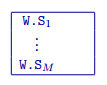
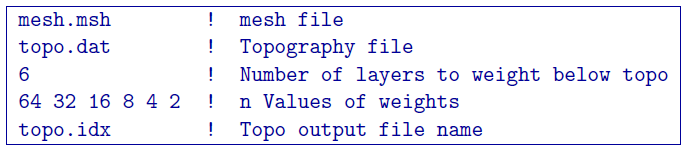

.. _weightsFile:

Weight files
============

There are two types of weighting files: cell-centred and interface weights. Each are described below.s

Cell-centred weights file
-------------------------

This file supplies the user-based weights that acts upon the model objective function. Each set of weights correspond to the functions (e.g., :math:`w_x`) given in the :ref:`model objective function <mof>`. For ease, the weights in geographic coordinates are provided by the user. The following is the file structure for the weights file:

Parameter definitions:

W.S\ :math:`_{i}`
        Cell weight for the :math:`i^{th}` cell of the smallest model component in the :ref:`model objective function <mof>`.

M
        The total number of cells in the model and its associated mesh (either octree or tensor).

Within each part, the values are ordered in the same way as in :ref:`model file <modelFile>`, however, they can be all on one line, or broken up over several lines. 

If the topography surface is supplied, the cell weights above the surface will be ignored. It is recommended that these weights be assigned a value of ``-1.0`` to avoid confusion. If ``NO_WEIGHT`` is given in the input files instead of the weights file, then all of the cell weights will be set equal (``1.0``).

Interface weights file
----------------------

This file supplies the user-defined interface weights that act upon the :ref:`model objective function <mof>`. The following is the file structure:

Parameter definitions:

W.E\ :math:`_{i}`
        Weight for the :math:`i^{th}` interface perpendicular to the easting direction.

W.N\ :math:`_{i}`
        Weight for the :math:`i^{th}` interface perpendicular to the northing direction.

W.Z\ :math:`_{i}`
        Weight for the :math:`i^{th}` interface perpendicular to the vertical direction.

NIE
        The number of cell interfaces perpendicular to the easting direction.

NIN
        The number of cell interfaces perpendicular to the northing direction.

NIZ
        The number of cell interfaces perpendicular to the vertical direction.

Within each part, the values are ordered in the same way as in the :ref:`model <modelFile>` file. Since these weights for a derivative term of the :ref:`model objective function <mof>` are applied to the interface/boundary between cells, the weights have one fewer value in that direction. For instance, the weights for the derivative in easting direction has :math:`(NE-1) \times NN \times NZ` values, whereas the number of cells is :math:`NE \times NN \times NZ`.

If the topography surface is supplied, the cell weights above the surface will be ignored. It is recommended that these weights be assigned a value of ``-1.0`` to avoid confusion. If ``NO_FACE_WEIGHT`` is given in the input files instead of the weights file, then all of the cell weights will be set equal (``1.0``).

