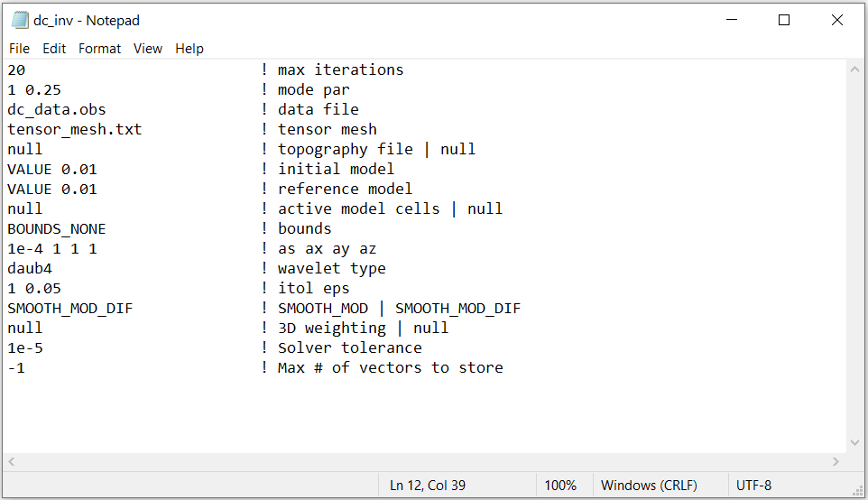

.. _dcip_input_dcinv:

DC Inversion Input File
=======================

The inverse problem is solved using the executable program **dcinv3d.exe**. The lines of input file are as follows:

.. tabularcolumns:: |L|C|C|

+--------+---------------------------------------------------------------------+-------------------------------------------------------------------+
| Line # | Description                                                         | Description                                                       |
+========+=====================================================================+===================================================================+
| 1      | :ref:`maxit<dcip_input_dcinv_ln1>`                                  | max trade off parameter iterations                                |
+--------+---------------------------------------------------------------------+-------------------------------------------------------------------+
| 2      | :ref:`mode par<dcip_input_dcinv_ln2>`                               | inversion mode and stopping criteria                              |
+--------+---------------------------------------------------------------------+-------------------------------------------------------------------+
| 3      | :ref:`DC Observations File<dcip_input_dcinv_ln3>`                   | path to observations file                                         |
+--------+---------------------------------------------------------------------+-------------------------------------------------------------------+
| 4      | :ref:`Tensor Mesh<dcip_input_dcinv_ln4>`                            | path to tensor mesh file                                          |
+--------+---------------------------------------------------------------------+-------------------------------------------------------------------+
| 5      | :ref:`Topography<dcip_input_dcinv_ln5>`                             | topography                                                        |
+--------+---------------------------------------------------------------------+-------------------------------------------------------------------+
| 6      | :ref:`Initial Model<dcip_input_dcinv_ln6>`                          | initial model                                                     |
+--------+---------------------------------------------------------------------+-------------------------------------------------------------------+
| 7      | :ref:`Reference Model<dcip_input_dcinv_ln7>`                        | reference model                                                   |
+--------+---------------------------------------------------------------------+-------------------------------------------------------------------+
| 8      | :ref:`Active Model Cells<dcip_input_dcinv_ln8>`                     | active model cells                                                |
+--------+---------------------------------------------------------------------+-------------------------------------------------------------------+
| 9      | :ref:`Bounds<dcip_input_dcinv_ln9>`                                 | upper and lower bounds for recovered model                        |
+--------+---------------------------------------------------------------------+-------------------------------------------------------------------+
| 10     | :ref:`alpha_s alpha_x alpha_y alpha_z<dcip_input_dcinv_ln10>`       | weighting constants for smallness and smoothness constraints      |
+--------+---------------------------------------------------------------------+-------------------------------------------------------------------+
| 11     | :ref:`wvltx<dcip_input_dcinv_ln11>`                                 | wavelet type                                                      |
+--------+---------------------------------------------------------------------+-------------------------------------------------------------------+
| 12     | :ref:`itol eps<dcip_input_dcinv_ln12>`                              | reconstruction error for wavelet compression                      |
+--------+---------------------------------------------------------------------+-------------------------------------------------------------------+
| 13     | :ref:`Hard Constraints<dcip_input_dcinv_ln13>`                      | use *SMOOTH_MOD* or *SMOOTH_MOD_DIFF*                             |
+--------+---------------------------------------------------------------------+-------------------------------------------------------------------+
| 14     | :ref:`Weights<dcip_input_dcinv_ln14>`                               | weights                                                           |
+--------+---------------------------------------------------------------------+-------------------------------------------------------------------+
| 15     | :ref:`tol<dcip_input_dcinv_ln15>`                                   | solver tolerance                                                  |
+--------+---------------------------------------------------------------------+-------------------------------------------------------------------+
| 16     | :ref:`vec<dcip_input_dcinv_ln16>`                                   | Max number of stored solutions in memory                          |
+--------+---------------------------------------------------------------------+-------------------------------------------------------------------+

     Example input file for the DC inversion program (`Download <https://github.com/ubcgif/dcip3d/raw/master/assets/dcip_input/dc_inv.inp>`__ ).

Line Descriptions
^^^^^^^^^^^^^^^^^

.. _dcip_input_dcinv_ln1:

    - **maxit:** maximum number of trade-off parameter iterations. That is, the maximum number of time the trade-off parameters is reduced and the optimization problem is solved to recover a model

.. _dcip_input_dcinv_ln2:

    - **mode par:** set the mode for choosing the trade-off parameter and stopping criteria. Choices are as follows:

        - An integer specifying one of the two choices for determining the trade-off parameter (a real value):

            - *mode=1:* the program chooses the trade off parameter by carrying out a line search so that the target value of data misfit is achieved (e.g., :math:`\phi_d = N`). *par* is the chi-factor for the target misfit (usually 1.0).
            - *mode=2:* the user solves the optimization problem for a user-defined trade-off parameter given by *par*.
            - *mode=3:* the program calculates the trade-off parameter according to the L-curve criterion and *par* is ignored data The DC observation locations (with standard deviations).

.. _dcip_input_dcinv_ln3:

    - **DC Observation File:** path to a DC formatted observations file

.. _dcip_input_dcinv_ln4:

    - **Tensor Mesh:** file path to the tensor mesh file

.. _dcip_input_dcinv_ln5:

    - **Topography:** Define the cells which lie above and below the surface topography. There are three options:

        - *null:* this flag is used if all cells are defined as being below the surface topography
        - *active cells model:* the user can enter the path to an active cells model where 1 denotes cells below the surface and 0 denotes cells above the surface
        - *topography file:* the user can enter the path to a topography file which contains the xyz locations for a discrete set of points

.. note:: **Be carefull!!!** If the survey file uses the *surface format*, the code will project the electrode locations to the discrete surface when topography is applied. If the survey file uses the *general format*, cells might be modeled as being in the air.

.. _dcip_input_dcinv_ln6:

    - **Initial Model:** On this line we specify the starting model for the inversion. On this line, there are 2 possible options:

        - Enter the path to a conductivity model
        - If a homogeneous conductivity value is being used, enter "VALUE" followed by a space and a numerical value; example "VALUE 0.01".

.. _dcip_input_dcinv_ln7:

    - **Reference Model:** The user may supply the file path to a reference conductivity model. On this line, there are 2 possible options:

        - Enter the path to a conductivity model
        - If a homogeneous conductivity value is being used, enter "VALUE" followed by a space and a numerical value; example "VALUE 0.01".

.. _dcip_input_dcinv_ln8:

    - **Active Model Cells:** Here, the user can choose to specify the model cells which are active during the inversion. There are two options:

        - *null:* this flag is used if all cells below the surface topography are active
        - *active cells model:* the user can enter the path to an active cells model where 1 denotes cells below the surface and 1 denotes active cells and 0 denotes inactive cells

.. _dcip_input_dcinv_ln9:

    - **Bounds:** Bound constraints on the recovered model. There are 3 options:

        - Enter the flag "BOUNDS_NONE" if the inversion is unbounded, or if there is no a-prior information about the subsurface model
        - Enter "BOUNDS_CONST" and enter the values of the minimum and maximum model conductivity; example "BOUNDS_CONST 1E-6 0.1"
        - Enter "BOUNDS_FILE" followed by the path to a :ref:`bounds file <boundsFile>`

.. _dcip_input_dcinv_ln10:

    - **alpha_s alpha_x alpha_y alpha_z:** `Alpha parameters <http://giftoolscookbook.readthedocs.io/en/latest/content/fundamentals/Alphas.html>`__ . Here, the user specifies the relative weighting between the smallness and smoothness component penalties on the recovered models.

.. _dcip_input_sens_ln11:

    - **wvltx:** A five-character string identifying the type of wavelet used to compress the sensitivity matrix. The types of wavelets available are Daubechies wavelet with 1 to 6 vanishing moments (*daub1*, *daub2*, and so on) and Symmlets with 4 to 6 vanishing moments (*symm4*, *symm5*, *symm6*). Note that daub1 is the Haar wavelet and daub2 is the Daubechies-4 wavelet. The Daubechies- 4 wavelet is suitable for most inversions (and is used for the null option, while the others are provided for users’ experimentation. If none is entered, the program does not use wavelet compression.

.. _dcip_input_sens_ln12:

    - **itol eps:** An integer and a real number that specify how the wavelet threshold level is to be determined. If *null* is entered on this line, a default relative reconstruction error of 0.05 (e.g. 5%) is used and the relative threshold level is calculated (i.e., itol=1, eps=0.05).

        - *itol=1:* program calculates the relative threshold and *eps* is the relative reconstruction error of the sensitivity. A reconstruction error of 0.05 is usually adequate.
        - *itol=2:* the user defines the threshold level and *eps* is the relative threshold to be used. 

.. _dcip_input_dcinv_ln13:

    - **Hard Constraints:** SMOOTH_MOD runs the inversion without implementing a reference model (essential :math:`m_{ref}=0`). "SMOOTH_MOD_DIF" constrains the inversion in the smallness and smoothness terms using a reference model.

.. _dcip_input_dcinv_ln14:

    - **Weights:** Apply cell and/or interface weights to the inversion. There are two options:

        - *null:* enter this flag if no additional weights are applied
        - *weights file:* enter the file path to a weights file to apply weights

.. _dcip_input_fwd_ln15:

    - **tol:** relative tolerance for solving the system. A default value of 1e-5 works well.

.. _dcip_input_fwd_ln16:

    - **vec:** An integer which specifies how many solution vectors are to be stored in the computer’s memory at one time. Use -1 to store all vectors in memory.

