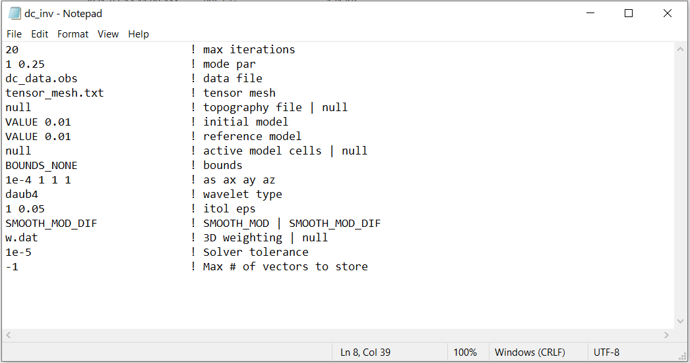

.. _dcip_input_dcinv:

DC Inversion Input File
=======================

The inverse problem is solved using the executable program **dcoctree_inv.exe**. The lines of input file are as follows:

.. tabularcolumns:: |L|C|C|

+--------+---------------------------------------------------------------------+-------------------------------------------------------------------+
| Line # | Description                                                         | Description                                                       |
+========+=====================================================================+===================================================================+
| 1      | :ref:`OcTree Mesh<dcip_input_dcinv_ln1>`                            | path to octree mesh file                                          |
+--------+---------------------------------------------------------------------+-------------------------------------------------------------------+
| 2      | :ref:`Observations File<dcip_input_dcinv_ln2>`                      | path to observations file                                         |
+--------+---------------------------------------------------------------------+-------------------------------------------------------------------+
| 3      | :ref:`Initial/FWD Model<dcip_input_dcinv_ln3>`                      | initial/forward model                                             |
+--------+---------------------------------------------------------------------+-------------------------------------------------------------------+
| 4      | :ref:`Reference Model<dcip_input_dcinv_ln4>`                        | reference model                                                   |
+--------+---------------------------------------------------------------------+-------------------------------------------------------------------+
| 5      | :ref:`Active Topography Cells<dcip_input_dcinv_ln5>`                | topography                                                        |
+--------+---------------------------------------------------------------------+-------------------------------------------------------------------+
| 6      | :ref:`Active Model Cells<dcip_input_dcinv_ln6>`                     | active model cells                                                |
+--------+---------------------------------------------------------------------+-------------------------------------------------------------------+
| 7      | :ref:`Global Cell Weights<dcip_input_dcinv_ln7>`                    | global cell weights                                               |
+--------+---------------------------------------------------------------------+-------------------------------------------------------------------+
| 8      | :ref:`Global Face Weights<dcip_input_dcinv_ln8>`                    | global face weights                                               |
+--------+---------------------------------------------------------------------+-------------------------------------------------------------------+
| 9      | :ref:`Additional Smallness Cell Weights<dcip_input_dcinv_ln9>`      | additional cell weights in smallness term                         |
+--------+---------------------------------------------------------------------+-------------------------------------------------------------------+
| 10     | :ref:`beta_max beta_min beta_factor<dcip_input_dcinv_ln10>`         | cooling schedule for beta parameter                               |
+--------+---------------------------------------------------------------------+-------------------------------------------------------------------+
| 11     | :ref:`alpha_s alpha_x alpha_y alpha_z<dcip_input_dcinv_ln11>`       | weighting constants for smallness and smoothness constraints      |
+--------+---------------------------------------------------------------------+-------------------------------------------------------------------+
| 12     | :ref:`Chi Factor<dcip_input_dcinv_ln12>`                            | stopping criteria for inversion                                   |
+--------+---------------------------------------------------------------------+-------------------------------------------------------------------+
| 13     | :ref:`tol_nl mindm iter_per_beta<dcip_input_dcinv_ln13>`            | set the number of Gauss-Newton iteration for each beta value      |
+--------+---------------------------------------------------------------------+-------------------------------------------------------------------+
| 14     | :ref:`tol_ipcg max_iter_ipcg<dcip_input_dcinv_ln14>`                | set the tolerance and number of iterations for Gauss-Newton solve |
+--------+---------------------------------------------------------------------+-------------------------------------------------------------------+
| 15     | :ref:`Reference Model Update<dcip_input_dcinv_ln15>`                | reference model                                                   |
+--------+---------------------------------------------------------------------+-------------------------------------------------------------------+
| 16     | :ref:`Hard Constraints<dcip_input_dcinv_ln16>`                      | use *SMOOTH_MOD* or *SMOOTH_MOD_DIFF*                             |
+--------+---------------------------------------------------------------------+-------------------------------------------------------------------+
| 17     | :ref:`Bounds<dcip_input_dcinv_ln17>`                                | upper and lower bounds for recovered model                        |
+--------+---------------------------------------------------------------------+-------------------------------------------------------------------+

     Example input file for the inversion program (`Download <https://github.com/ubcgif/DCIPoctree/raw/master/assets/dcip_input/dc_inv.inp>`__ ).

Line Descriptions
^^^^^^^^^^^^^^^^^

.. _dcip_input_dcinv_ln1:

    - **OcTree Mesh:** file path to the OcTree mesh file

.. _dcip_input_dcinv_ln2:

    - **Observation File:** On this line, we enter a flag *LOC_XY* or *LOC_XYZ*, followed by the file path to the :ref:`observations file<obsFile>`. The flag tells the program whether the electrodes are only on the surface or whether there are borehole measurements.

        - *LOC_XY filepath:* The electrodes are all on the Earth's surface. The vertical position is defined by the topography line.
        - *LOC_XYZ filepath:* The observations file contains borehole data.

.. _dcip_input_dcinv_ln3:

    - **Initial Model:** On this line we specify the starting model for the inversion. On this line, there are 2 possible options:

        - Enter the path to a conductivity model
        - If a homogeneous conductivity value is being used, enter "VALUE" followed by a space and a numerical value; example "VALUE 0.01".

.. _dcip_input_dcinv_ln4:

    - **Reference Model:** The user may supply the file path to a reference conductivity model. On this line, there are 2 possible options:

        - Enter the path to a conductivity model
        - If a homogeneous conductivity value is being used, enter "VALUE" followed by a space and a numerical value; example "VALUE 0.01".

.. _dcip_input_dcinv_ln5:

    - **Active Topography Cells:** Here, the user can choose to specify the cells which lie below the surface topography. To do this, the user may supply the file path to an active cells model file or type "ALL_ACTIVE". The active cells model has values 1 for cells lying below the surface topography and values 0 for cells lying above.

.. _dcip_input_dcinv_ln6:

    - **Active Model Cells:** Here, the user can choose to specify the model cells which are active during the inversion. To do this, the user may supply the file path to an active cells model file or type "ALL_ACTIVE". The active cells model has values 1 for cells lying below the surface topography and values 0 for cells lying above. Values for inactive cells are provided by the background conductivity model.

.. _dcip_input_dcinv_ln7:

    - **Global Cell Weights:** Here, the user specifies cell weights that are applied in both the smallness and smoothness terms in the model objective function. The user can provide the file path to a :ref:`cell weights file <weightsFile>` . If no cell weights are supplied, the user enters "NO_WEIGHT".

.. _dcip_input_dcinv_ln8:

    - **Global Face Weights:** Here, the user specifies whether face weights are supplied. If so, the user provides the file path to a face weights file :ref:`cell weights file <weightsFile>`. If no additional cell weights are supplied, the user enters "NO_FACE_WEIGHT". The user may also enter "EKBLOM" for 1-norm approximation to recover sharper edges.

.. _dcip_input_dcinv_ln9:

    - **Additional Cell Weights in Smallness term:** Here, the user can specify cell weights that are ONLY applied to the smallness term in the model objective function; e.g. they are not used in the smoothness. The user can provide the file path to a :ref:`cell weights file <weightsFile>` . For no additional weighting, the user enters the flag "NO_WEIGHT".

.. _dcip_input_dcinv_ln10:

    - **beta_max beta_min beta_factor:** Here, the user specifies protocols for the trade-off parameter (beta). *beta_max* is the initial value of beta, *beta_min* is the minimum allowable beta the program can use before quitting and *beta_factor* defines the factor by which beta is decreased at each iteration; example "1E4 10 0.2". The user may also enter "DEFAULT" if they wish to have beta calculated automatically.

.. _dcip_input_dcinv_ln11:

    - **alpha_s alpha_x alpha_y alpha_z:** `Alpha parameters <http://giftoolscookbook.readthedocs.io/en/latest/content/fundamentals/Alphas.html>`__ . Here, the user specifies the relative weighting between the smallness and smoothness component penalties on the recovered models.

.. _dcip_input_dcinv_ln12:

    - **Chi Factor:** The chi factor defines the target misfit for the inversion. A chi factor of 1 means the target misfit is equal to the total number of data observations.

.. _dcip_input_dcinv_ln13:

    - **tol_nl mindm iter_per_beta:** Here, the user specifies the number of Newton iterations. *tol_nl* is the Newton iteration tolerance (how close the gradient is to zero), *mindm* is the minimum model perturbation :math:`\delta m` allowed and *iter_per_beta* is the number of iterations per beta value.

.. _dcip_input_dcinv_ln14:

    - **tol_ipcg max_iter_ipcg:** Here, the user specifies solver parameters. *tol_ipcg* defines how well the iterative solver does when solving for :math:`\delta m` and *max_iter_ipcg* is the maximum iterations of incomplete-preconditioned-conjugate gradient.

.. _dcip_input_dcinv_ln15:

    - **Reference Model Update:** Here, the user specifies whether the reference model is updated at each inversion step result. If so, enter "CHANGE_MREF". If not, enter "NOT_CHANGE_MREF".

.. _dcip_input_dcinv_ln16:

    - **Hard Constraints:** SMOOTH_MOD runs the inversion without implementing a reference model (essential :math:`m_{ref}=0`). "SMOOTH_MOD_DIF" constrains the inversion in the smallness and smoothness terms using a reference model.

.. _dcip_input_dcinv_ln17:

    - **Bounds:** Bound constraints on the recovered model. There are 3 options:

        - Enter the flag "BOUNDS_NONE" if the inversion is unbounded, or if there is no a-prior information about the subsurface model
        - Enter "BOUNDS_CONST" and enter the values of the minimum and maximum model conductivity; example "BOUNDS_CONST 1E-6 0.1"
        - Enter "BOUNDS_FILE" followed by the path to a :ref:`bounds file <boundsFile>`

