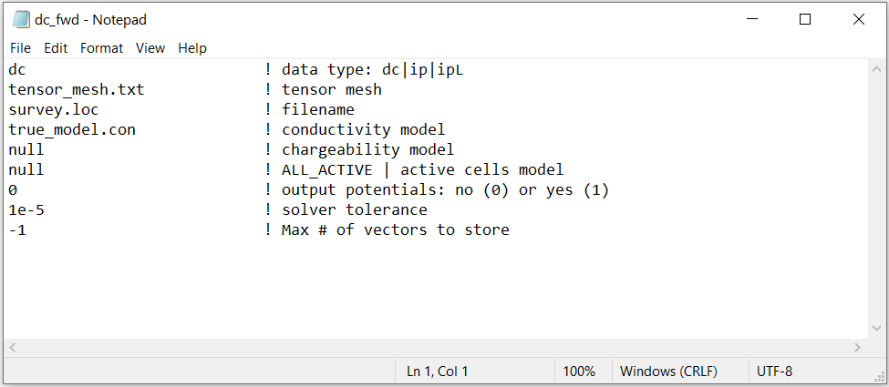

.. _dcip_input_fwd:

Forward Modeling Input File
===========================

The forward problem for both DC and IP data is solved using the executable program **dcipf3d_55.exe**. The lines of input file are as follows:

.. tabularcolumns:: |L|C|C|

+--------+-------------------------------------------------------------------+-------------------------------------------------------------------+
| Line # | Description                                                       | Description                                                       |
+========+===================================================================+===================================================================+
| 1      | :ref:`Data Type<dcip_input_fwd_ln1>`                              | data being modeled: dc | ip | ipL                                 |
+--------+-------------------------------------------------------------------+-------------------------------------------------------------------+
| 2      | :ref:`Tensor Mesh<dcip_input_fwd_ln2>`                            | path to tensor mesh file                                          |
+--------+-------------------------------------------------------------------+-------------------------------------------------------------------+
| 3      | :ref:`Survey File<dcip_input_fwd_ln3>`                            | path to survey file                                               |
+--------+-------------------------------------------------------------------+-------------------------------------------------------------------+
| 4      | :ref:`Conductivity Model<dcip_input_fwd_ln4>`                     | conductivity model                                                |
+--------+-------------------------------------------------------------------+-------------------------------------------------------------------+
| 5      | :ref:`Chargeability Model<dcip_input_fwd_ln5>`                    | chargeability model                                               |
+--------+-------------------------------------------------------------------+-------------------------------------------------------------------+
| 6      | :ref:`Active Topography Cells<dcip_input_fwd_ln6>`                | topography                                                        |
+--------+-------------------------------------------------------------------+-------------------------------------------------------------------+
| 7      | :ref:`pot<dcip_input_fwd_ln7>`                                    | output potentials file                                            |
+--------+-------------------------------------------------------------------+-------------------------------------------------------------------+
| 8      | :ref:`tol<dcip_input_fwd_ln8>`                                    | relative tolerance for solver                                     |
+--------+-------------------------------------------------------------------+-------------------------------------------------------------------+
| 9      | :ref:`vec<dcip_input_fwd_ln9>`                                    | Max number of vectors to store                                    |
+--------+-------------------------------------------------------------------+-------------------------------------------------------------------+

     Example input file for modeling DC data (`Download <https://github.com/ubcgif/dcip3d/raw/master/assets/dcip_input/dc_fwd.inp>`__ ).

Line Descriptions
^^^^^^^^^^^^^^^^^

.. _dcip_input_fwd_ln1:

    - **Data Type:** the user chooses a flag specifying the data which are modeled by the program:

        - *dc:* DC resistivity data are modeled. Although the line for the chargeability model is ignored, something must be put there as a placeholder.
        - *ip:* IP data are modeled with a non-linear formulation.
        - *ipL:* IP data are modeled with a linear formulation.

.. _dcip_input_fwd_ln2:

    - **Tensor Mesh:** file path to the :ref:`tensor mesh file <meshFile>`

.. _dcip_input_fwd_ln3:

    - **Survey File:** file path to the :ref:`survey file <surveyFile>`

.. _dcip_input_fwd_ln4:

    - **Conductivity Model:** file path to the :ref:`conductivity model <modelFile>`

.. _dcip_input_fwd_ln5:

    - **Chargeability Model:** The user may enter

        - the file path to a :ref:`chargeability model <modelFile>`
        - the flag *VALUE* followed by a float representing a homogeneous background conductivity

.. _dcip_input_fwd_ln6:

    - **Active Topography Cells:** Here, the user can choose to define the surface topography.

        - *null:* all cells lie below the surface topography
        - *topography file:* the user supplies the file path to a :ref:`topography file <topoFile>` which has the xyz locations for discrete topography
        - *active cells model:* the user supplies the file path to an :ref:`active cells model <activeFile>` which 1 denotes cells below the surface and 0 denotes cells above

.. note:: If the survey file is *surface format*, the electrode locations will be projected to the discretized surface when topography is included. If the survey file is *general format*, electrodes may be modeled as being in the air.

.. _dcip_input_fwd_ln7:

    - **pot:** Enter a flag of *1* to output a file containing the potentials or enter a flag of *0* to ignore.

.. _dcip_input_fwd_ln8:

    - **tol:** relative tolerance for solving the system. A default value of 1e-5 works well.

.. _dcip_input_fwd_ln9:

    - **vec:** An integer which specifies how many solution vectors are to be stored in the computer’s memory at one time. Use -1 to store all vectors in memory.
