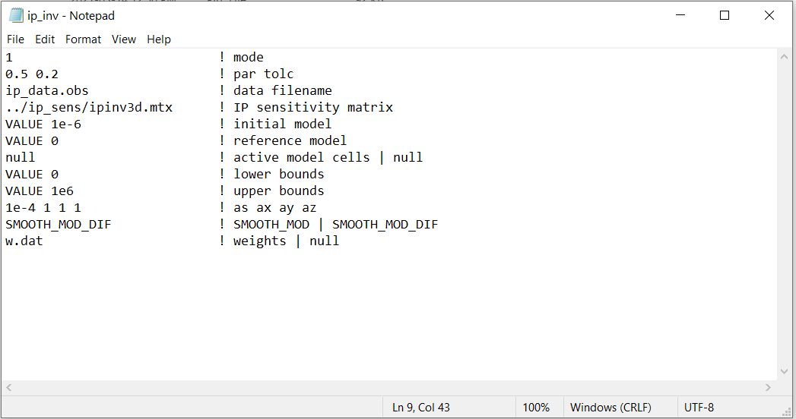

.. _dcip_input_ipinv:

IP Inversion Input File
=======================

The inverse problem is solved using the executable program **ipinv3d.exe**. The lines of input file are as follows:

.. tabularcolumns:: |L|C|C|

+--------+---------------------------------------------------------------------+-------------------------------------------------------------------+
| Line # | Description                                                         | Description                                                       |
+========+=====================================================================+===================================================================+
| 1      | :ref:`mode<dcip_input_ipinv_ln1>`                                   | inversion mode                                                    |
+--------+---------------------------------------------------------------------+-------------------------------------------------------------------+
| 2      | :ref:`par tolc<dcip_input_ipinv_ln2>`                               | stopping criteria                                                 |
+--------+---------------------------------------------------------------------+-------------------------------------------------------------------+
| 3      | :ref:`IP Observations File<dcip_input_ipinv_ln3>`                   | path to IP formatted observations file                            |
+--------+---------------------------------------------------------------------+-------------------------------------------------------------------+
| 4      | :ref:`Sensitivity Matrix<dcip_input_ipinv_ln4>`                     | path to sensitivity matrix file                                   |
+--------+---------------------------------------------------------------------+-------------------------------------------------------------------+
| 5      | :ref:`Initial Model<dcip_input_ipinv_ln5>`                          | initial model                                                     |
+--------+---------------------------------------------------------------------+-------------------------------------------------------------------+
| 6      | :ref:`Reference Model<dcip_input_ipinv_ln6>`                        | reference model                                                   |
+--------+---------------------------------------------------------------------+-------------------------------------------------------------------+
| 7      | :ref:`Active Model Cells<dcip_input_ipinv_ln7>`                     | active model cells                                                |
+--------+---------------------------------------------------------------------+-------------------------------------------------------------------+
| 8      | :ref:`Lower Bounds<dcip_input_ipinv_ln8>`                           | lower bounds for recovered model                                  |
+--------+---------------------------------------------------------------------+-------------------------------------------------------------------+
| 9      | :ref:`Upper Bounds<dcip_input_ipinv_ln9>`                           | upper bounds for recovered model                                  |
+--------+---------------------------------------------------------------------+-------------------------------------------------------------------+
| 10     | :ref:`alpha_s alpha_x alpha_y alpha_z<dcip_input_ipinv_ln10>`       | weighting constants for smallness and smoothness constraints      |
+--------+---------------------------------------------------------------------+-------------------------------------------------------------------+
| 11     | :ref:`Hard Constraints<dcip_input_ipinv_ln11>`                      | use *SMOOTH_MOD* or *SMOOTH_MOD_DIFF*                             |
+--------+---------------------------------------------------------------------+-------------------------------------------------------------------+
| 12     | :ref:`Weights<dcip_input_ipinv_ln12>`                               | weights                                                           |
+--------+---------------------------------------------------------------------+-------------------------------------------------------------------+

     Example input file for the IP inversion program (`Download <https://github.com/ubcgif/dcip3d/raw/master/assets/dcip_input/ip_inv.inp>`__ ).

Line Descriptions
^^^^^^^^^^^^^^^^^

.. _dcip_input_ipinv_ln1:

    - **mode:** approach used to determine the trade-off parameter

        - *mode=1:* the program chooses the trade off parameter by carrying out a line search so that the target value of data misfit is achieved (e.g., :math:`\phi_d = N`). *par* is the chi-factor for the target misfit (usually 1.0).
        - *mode=2:* the user solves the optimization problem for a user-defined trade-off parameter given by *par*.

.. _dcip_input_ipinv_ln2:

    - **par tolc:** set the mode for stopping criteria for the inversion. If *mode*=1, then the inversion will terminate when the data misfit is equivalent to a chi factor of :math:`par \pm tolc`

.. _dcip_input_ipinv_ln3:

    - **IP Observation File:** path to an IP formatted :ref:`observations file <obsFile>`

.. _dcip_input_ipinv_ln4:

    - **Sensitivity Matrix:** file path to sensitivity matrix file (.mtx) that is output by *ipsens3d.exe*

.. _dcip_input_ipinv_ln5:

    - **Initial Model:** On this line we specify the starting model for the inversion. On this line, there are 2 possible options:

        - Enter the path to a conductivity :ref:`model <modelFile>`
        - If a homogeneous conductivity value is being used, enter "VALUE" followed by a space and a numerical value; example "VALUE 0.01".

.. note:: DO NOT use a starting value of 0 otherwise the inversion cannot compute a step direction at the first iteration. It acceptible to start with something like 1e-5 for all cells.

.. _dcip_input_ipinv_ln6:

    - **Reference Model:** The user may supply the file path to a reference conductivity model. On this line, there are 2 possible options:

        - Enter the path to a conductivity :ref:`model <modelFile>`
        - If a homogeneous chargeability value is being used, enter "VALUE" followed by a space and a numerical value; example "VALUE 0.01".

.. _dcip_input_ipinv_ln7:

    - **Active Model Cells:** Here, the user can choose to specify the model cells which are active during the inversion. There are two options:

        - *null:* this flag is used if all cells below the surface topography are active
        - *active cells model:* the user can enter the path to an :ref:`active cells model <activeFile>` where 1 denotes cells below the surface and 1 denotes active cells and 0 denotes inactive cells

.. _dcip_input_ipinv_ln8:

    - **Lower Bounds:** Lower bound constraints on the recovered model. There are 2 options:

        - Enter the flag *VALUE* followed by the lower bound value that will applied to all cells
        - Enter the path to :ref:`model file <modelFile>` which contains a lower bound value for every cell in the mesh. Bounds for inactive cells are ignored

.. _dcip_input_ipinv_ln9:

    - **Upper Bounds:** Upper bound constraints on the recovered model. There are 2 options:

        - Enter the flag *VALUE* followed by the upper bound value that will applied to all cells
        - Enter the path to :ref:`model file <modelFile>` which contains an upper bound value for every cell in the mesh. Bounds for inactive cells are ignored

.. _dcip_input_ipinv_ln10:

    - **alpha_s alpha_x alpha_y alpha_z:** `Alpha parameters <http://giftoolscookbook.readthedocs.io/en/latest/content/fundamentals/Alphas.html>`__ . Here, the user specifies the relative weighting between the smallness and smoothness component penalties on the recovered models.

.. _dcip_input_ipinv_ln11:

    - **Hard Constraints:** SMOOTH_MOD runs the inversion without implementing a reference model (essential :math:`m_{ref}=0`). "SMOOTH_MOD_DIF" constrains the inversion in the smallness and smoothness terms using a reference model.

.. _dcip_input_ipinv_ln12:

    - **Weights:** Apply cell and/or interface weights to the inversion. There are two options:

        - *null:* enter this flag if no additional weights are applied
        - *weights file:* enter the file path to a :ref:`weights file <weightsFile>` to apply weights
