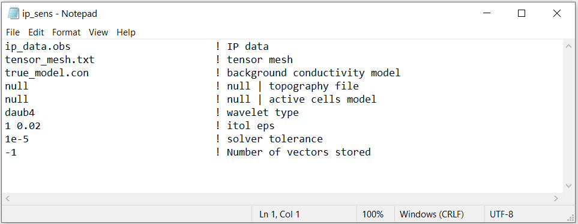

.. _dcip_input_sens:

IP Sensitivity Matrix Input File
================================

For the IP inverse problem, we use a linearized formulation. The linearized inverse problem requires that we construct the sensitivity matrix for the IP problem. This is done with the executable **ipsen3d.exe**. The lines of input file for creating the IP sensitivity matrix are as follows:

.. tabularcolumns:: |L|C|C|

+--------+----------------------------------------------------+---------------------------------------------------------+
| Line # | Parameter                                          | Description                                             |
+========+====================================================+=========================================================+
| 1      | :ref:`IP Observations File<dcip_input_sens_ln1>`   | path to IP formatted observations file                  |
+--------+----------------------------------------------------+---------------------------------------------------------+
| 2      | :ref:`Tensor Mesh<dcip_input_sens_ln2>`            | path to tensor mesh                                     |
+--------+----------------------------------------------------+---------------------------------------------------------+
| 3      | :ref:`Conductivity Model<dcip_input_sens_ln3>`     | path to conductivity model                              |
+--------+----------------------------------------------------+---------------------------------------------------------+
| 4      | :ref:`Topography<dcip_input_sens_ln4>`             | topography                                              |
+--------+----------------------------------------------------+---------------------------------------------------------+
| 5      | :ref:`Active Cells<dcip_input_sens_ln5>`           | active cells in inversion                               |
+--------+----------------------------------------------------+---------------------------------------------------------+
| 6      | :ref:`wvltx<dcip_input_sens_ln6>`                  | wavelet type for compression                            |
+--------+----------------------------------------------------+---------------------------------------------------------+
| 7      | :ref:`itol eps<dcip_input_sens_ln7>`               | wavelet tolerance and reconstruction accuracy           |
+--------+----------------------------------------------------+---------------------------------------------------------+
| 8      | :ref:`tol<dcip_input_sens_ln8>`                    | relative tolerance for solver                           |
+--------+----------------------------------------------------+---------------------------------------------------------+
| 9      | :ref:`vec<dcip_input_sens_ln9>`                    | max number of solution vectors to store                 |
+--------+----------------------------------------------------+---------------------------------------------------------+

    Example input file for computing IP sensitivity matrix ( `Download <https://github.com/ubcgif/dcip3d/raw/master/assets/dcip_input/ip_sens.inp>`__ ).

.. _dcip_input_sens_lines:

Line Descriptions
^^^^^^^^^^^^^^^^^

.. _dcip_input_sens_ln1:

    - **IP Observations File:** file path to IP formatted :ref:`observations file <obsFile>`

.. _dcip_input_sens_ln2:

    - **Tensor Mesh:** file path to the :ref:`tensor mesh <meshFile>` file

.. _dcip_input_sens_ln3:

    - **Conductivity Model:** On this line we specify the conductivity model for the sensitivity computation. On this line, there are 2 possible options:

        - Enter the path to a conductivity model (either starting model for DC inversion or background conductivity for IP inversion)
        - If a homogeneous conductivity value is being used, enter "VALUE" followed by a space and a numerical value; example "VALUE 0.01".

.. _dcip_input_sens_ln4:

    - **Active Topography Cells:** Here, the user can choose to define the surface topography.

        - *null:* all cells lie below the surface topography
        - *topography file:* the user supplies the file path to a :ref:`topography file <topoFile>` which has the xyz locations for discrete topography
        - *active cells model:* the user supplies the file path to an :ref:`active cells model <activeFile>` which 1 denotes cells below the surface and 0 denotes cells above

.. _dcip_input_sens_ln5:

    - **Active Model Cells:** Here, the user can choose to specify the model cells which will be active during the inversion.

        - *null:* all cells below the surface topography are active in the inversion
        - *active cells model:* the user supplies the file path to an :ref:`active cells model <activeFile>` which 1 denotes active cells and 0 denotes inactive cells

.. _dcip_input_sens_ln6:

    - **wvltx:** A five-character string identifying the type of wavelet used to compress the sensitivity matrix. The types of wavelets available are Daubechies wavelet with 1 to 6 vanishing moments (*daub1*, *daub2*, and so on) and Symmlets with 4 to 6 vanishing moments (*symm4*, *symm5*, *symm6*). Note that daub1 is the Haar wavelet and daub2 is the Daubechies-4 wavelet. The Daubechies- 4 wavelet is suitable for most inversions (and is used for the null option, while the others are provided for users’ experimentation. If none is entered, the program does not use wavelet compression.

.. _dcip_input_sens_ln7:

    - **itol eps:** An integer and a real number that specify how the wavelet threshold level is to be determined. If *null* is entered on this line, a default relative reconstruction error of 0.05 (e.g. 5%) is used and the relative threshold level is calculated (i.e., itol=1, eps=0.05).

        - *itol=1:* program calculates the relative threshold and *eps* is the relative reconstruction error of the sensitivity. A reconstruction error of 0.05 is usually adequate.
        - *itol=2:* the user defines the threshold level and *eps* is the relative threshold to be used. 

.. _dcip_input_sens_ln8:

    - **tol:** relative tolerance for solving the system. A default value of 1e-5 works well.

.. _dcip_input_sens_ln9:

    - **vec:** An integer which specifies how many solution vectors are to be stored in the computer’s memory at one time. Use -1 to store all vectors in memory.

