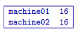

.. _runPrograms:

Running the programs
====================

The DCIPoctree library consists of three core programs and nine utilities.

Core Programs:

- ``DCIPoctreeFwd``: Forward model conductivity/chargeability models to calculate data

- ``DCoctreeInv``: Invert 3D DC data to develop a conductivity model

- ``IPoctreeInv``: Invert 3D IP data to develop a chargeablility model

Utilities:

- ``create_octree_mesh``: Create an octree mesh file from electrode locations and optionally topography

- ``3DModel2Octree``: Convert from a 3D UBC-GIF mesh/model to an octree mesh/model

- ``octreeTo3D``: Convert from an octree mesh/model to a standard 3D UBC-GIF mesh/model

- ``refine_octree``: Make an octree mesh finer based on the values of the input model

- ``remesh_octree_model``: Convert a model from one octree mesh to another

- ``surface_electrodes``: Place the electrodes on the topographic surface

- ``octree_cell_centre``: Read in an octree mesh, and output a 3-columns file of cell centres

- ``interface_weights``: Create a weight file for the octree cell interfaces

- ``create_weight_file``: Create an octree cell weighting file

This section discusses the use of these codes individually.

Introduction
------------

All programs in the package can be executed under Windows or Linux environments. They can be run by either typing the program name by itself, or followed by a control file in the command promp (Windows) or terminal (Linux). They can be executed directly on the command line or in a shell script or batch file. When a program is executed without any arguments, it will either print a simple message describing the usage or otherwise search for a proper control file name in the working directory. If this is the case, then the name of the corresponding control file (if changed by the user) will result in termination of the executable, followed by an error message. If the hard-coded name is used, the program will run.

Some executables require more than one input argument.

Execution on a single computer
------------------------------
The command format for use on a single processor is described below. Within the command prompt or terminal, any of the programs can be called using:

.. code-block:: rst

        program arg1 [arg2 ... argi]

where:

program
        is the name of the executable

argi
        is a command line argument, which can be a name of corresponding required or optional file. Typing **-inp** as the input file serves as a help function and returns an example input file. Some executables do not require input files and **program** should be followed by multiple arguments instead. This will be discussed in more detail later in this section for specific programs.

Each input control file contains a formatted list of arguments, parameters, and filenames specific to the executable. All input control file formats are explain in detail within this section.

For many large data sets, running one of the codes may require a prohibitively long time, so it is often useful to parallelize the job and send it to multiple processors (cores) on the same computer. The parallelization of the code depends on the version of the code, as described below:

1. Version 1.0: The DCIPoctree program library's main programs have been parallelized with Message Pass Interface (MPI). The MPI installation package can be downloaded `here <http://www.mcs.anl.gov/research/projects/mpich2/>`__.  The following is an example of a command line executing an MPI process to run ``DCIPoctreeFwd`` on 4 processors of the local machine:

.. code-block:: rst

        "C:\Program Files\MPICH2\bin\mpiexec.exe" -localonly 4 -priority 1 DCIPoctreeFwd

Here, the input arguments are:

PATH
        Properly defined path to mpiexec.exe

-localonly #
        Tells the machine that the job is only going to be run on the local machine, and not on a local network or cluster. The number (#) that follows specifies the total number of processors (cores) to be used.

-priority #
        Sets the priority of the process. The number (#) that follow is an integer from -1 (lowest) to 4 (highest). Higher priority means that RAM and processing resources will be primarily allocated for this process, at expense of lower priority processes. Generally, a large job should be assigned a lower priority, as selective resource allocation may slow down other important processes on the computer, including those needed for stable functioning of the operating system.

program
        The name of the executable. In this example, it is assumed that there is an existing path to the executable directory, otherwise the proper path should be provided.

2. Version 1.0 (201402 and later): These codes use Pardiso and do not rely on MPI. The names will include "pardiso" (i.e., DCoctreeInv_pardiso). The following is an example of a command line executing the pardiso code:

.. code-block:: rst

        DCIPoctreeFwd_pardiso inputfile.inp
 
Execution on a local network or cluster
---------------------------------------

MPI can also be used to run the DCIPoctree core programs on a local nestwork or cluster. The requirements for running an MPI job on a local network or cluster are as follows:

- An identical version of MPI must be installed on all participating machines.

- The user must create an identical network account with matching username and password on every machine.

- Both the executable folder and the working directory need to be shared and visible on every participating computer.

- Before the MPI job is executed, the firewall on all participating computers should be turned off.

- The path should be defined to the executable directory.

The following is an example for running on a local network or cluster:

.. code-block:: rst

        "C:\Program Files\MPICH2\bin\mpiexec.exe" -machinefile machine.txt -n 32 -priority 0 DCIPoctreeFwd

Here, the input arguments are:

PATH
        Properly defined path to mpiexec.exe

-machinefile machinefile.txt
        The list of participating machines will be read from a machine file. This file lists the network names of the participating machines and number of processors to be allocated for the MPI job for each machine. The following is an example of a machine file:

-n #
        The total number (#) of allocated processors. This number should be equal to the sum of all processors listed for all machines in the machine file.

-priority #
        Sets the priority of the process. The number (#) that follow is an integer from -1 (lowest) to 4 (highest). Higher priority means that RAM and processing resources will be primarily allocated for this process, at expense of lower priority processes. Generally, a large job should be assigned a lower priority, as selective resource allocation may slow down other important processes on the computer, including those needed for stable functioning of the operating system.

program
        The name of the executable. In this example, it is assumed that there is an existing path to the executable directory, otherwise the proper path should be provided.

Programs
--------

.. toctree::
        :maxdepth: 1

        DCIPoctreeFwd <runprog/fwd>
        DCoctreeInv <runprog/dcinv>
        IPoctreeInv <runprog/ipinv>
        create_octree_mesh <runprog/createoctreemesh>
        refine_octree <runprog/refineoctree>
        remesh_octree_model <runprog/remeshoctreemodel>
        octreeTo3D <runprog/octreeTo3D>
        3Dmodel2octree <runprog/3dmodel2octree>
        surface_electrodes <runprog/surfaceelectrodes>
        create_weight_file <runprog/createweightsfile>
        interface_weights <runprog/interfaceweights> 

