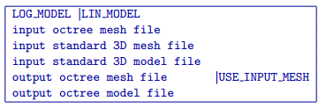

.. _3dmodel2octree:

3Dmodel2octree
==============

This utility is designed to convert an existing tensor 3D model, defined over a tensor mesh, into a new octree model defined over an existing octree mesh. In order for this utility to work, the tensor mesh and model must have a uniform cell size (i.e., all cells need to have the same dimensions and any padding cells need to be removed). This cell size should be the same as the smallest octree mesh cell size (base mesh cell size). To call the utility, use the following command from a command prompt:

.. code-block:: rst

  3Dmodel2octree control_file.inp
  
This utility work with an input file (i.e., control_file.inp), which is described below.

Control parameters and input files
----------------------------------

The input file format is as follows:

  
The input file requires the following parameters:

LOG_MODEL | LIN_MODEL
  Linear versus logarithmically scaled model file. LOG_MODEL is typically used for conductivity models while LIN_MODEL is usually used for chargeability models.

input octree mesh file
  Input octree mesh on which to define the new octree model.

input standard 3D mesh file
  Input tensor 3D mesh on which the tensor model is based.

input standard 3D model file
  Input tensor 3D model to convert on to an octree mesh.

output octree mesh file | USE_INPUT_MESH
  Desired filename of a new generated octree mesh. The USE_INPUT_MESH option can be used to use the original octree mesh defined on Line 2.

output octree model file  
  Desired filename of the new generated octree model.

Output files
------------

output octree mesh file
  Newly generated octree mesh, if the USE_INPUT_MESH option was not used.

output octree model file  
  The generated octree model.
  
**NOTE**: Unless the USE_INPUT_MESH option was selected, the input and output octree meshes will not be the same. This is because the input octree mesh, which was dependent on the electrode locations and optional topography, is refined and cells are subdivided to improve model resolution in regions of the model where structures exist. For this reason, the output octree mesh will always have more cells than the input octree mesh unless the input standard model is a uniform halfspace or wholespace. The more structure the input standard model has, the large the size of the output octree mesh and model will be.
