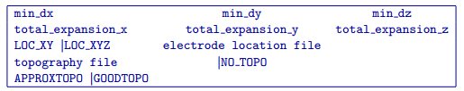

.. _createoctreemesh:

create_octree_mesh
==================

This utility creates an octree mesh from electrode locations and optionally a topography file. The utility is called from a command promtp as following:

.. code-block: rst

  create_octree_mesh create_mesh.inp
  
This utility requires an input control file to exist in the working directory (i.e., create_mesh.inp).

Control parameters and input files
----------------------------------

The following is an example of the control file format:

  
The input parameters for the file are:

min_dx min_dy min_dz
  The size of the base mesh cell (smallest possible cell) in metres.
  
total_expansion_x total_expansion_y total_expansion_z
  Defines the padding distance in metres outside of the survey area in each direction.
  
LOC_XY | LOC_XYZ file
  Electrode location file which is needed for assigning the lateral extent and the depth of the core mesh region based on the electrode geometry. The lateral extent is consistent with the lateral extent of the survey and the depth is assined as half of the maximum transmitter-receiver distance.
  
topography file | NO_TOPO
  Topography file. If no topography is used, then the NO_TOPO option should be provided.
  
APPROX_TOPO | GOOD_TOPO
  This options allows the user to control the number of cells that are used to define topography in the padding cell region. GOOD_TOPO will define the topography in the padding region very accurately using a large number of fine cells, while APPROX_TOPO will approximate the topo in the padding region using a smaller number of coarser cells. Since it is typically not crucial to have well-defined topography in the paddion region, APPROX_TOPO minimizes the number of padding cells in the octree mesh, which helps to improve computational efficiency.

Output files
------------

The following files are created by the utility:

octree_mesh.log
  Log file specifying the parameters used by the create_octree_mesh utility.

octree_mesh_#.txt
  Created octree mesh. During the mesh creation process, the user is given 40 different size options which allows control of the total number of cells in the output octree mesh. Cell sizes will range grom relatively coarse to nearly as fine as the underlying mesh. The selected number will be reflected in the name of the produced octree mesh (i.e., octree_mesh_23.txt).

active_cells.txt
  The active cell model file which defines the inactive air cells as those which lie above the topographic surface. This file is only output if a topography file was provided.

3D_mesh_core.txt
  Tensor 3D mesh for on the core region of the survey using the user-defined smallest cell size.

3D_mesh.txt
  Tensor 3D mesh for the entire volume using the user-defined smallest cell size.

data_z.txt
  Contains the data file with electrodes places on theh surface. If LOC_XYZ is specified, electrodes above the surface will be moved to the surface, and electrode locations below the surface will be unchanged. This file is only output when there is topography specified.

