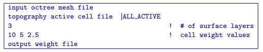

.. _createweightsfile:

create_weights_file
===================

This utility is designed to build an octree cell weighting file. Since these are cell weights, they are assigned to the cell centers. While the primary use of this weighting file is to help control the variability of the physical properties in the near surface layers of the recovered model, it can also be manually edited to place more/less weight on particular model cells where a priori information may be available. The command line usage is as following:

.. code-block:: rst

  create_weight_file weight.inp
  
The utility requires an input file (i.e., weight.inp) that contains specific parameters, which are described below.
  
Control parameters and input files
----------------------------------

The following shows the different parameters requires for the input file:

  
Each parameter is described in detail below:

input octree mesh file
  Input octree mesh on which the topography active cell file is defined

topography active cell file | ALL_ACTIVE
  Input active cell model which defines the topography. ALL_ACTIVE can be used if there is no topography and all model cells are active.

number of surface layers
  An integer that defines the number (i.e., 3) of surface layers to apply weights to. Each layer is a single cell in thickness. Since cell thickness will vary throughout the octree model, the layers are defined on the core region of the model which contains the smallest cells. The cell weights are then assigned based on where the top southwest corner of the cell falls (i.e., for a large padding cell near the edge of the octree mesh, the topmost cell might be ten times thicker than the smallest surface cell in the core region. In this case, this entire cell would be assigned the weight of the surface layer. All of the cell beneath this edge cell would remain unweighted because the top southwest corners lie below the depth of the second and third layers, as defined by the smaller surface cells in the core region of the model).

cell weight values
  A cell weight value is required for each of the surface layers. All weight values must be greater than or equal to 1, with 1 denoting no weight and high numbers heavilty weighting the cell towards the reference model. For example, for 3 surface layers, the cell weight values could be "10 5 2.5", as shown in the example input file.

output weight values
  Desired filename for the output weight values.

Output files
------------

output weight values
  Output cell surface weight file.
