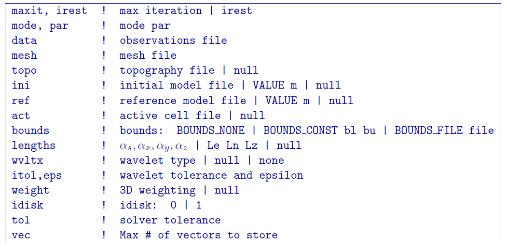
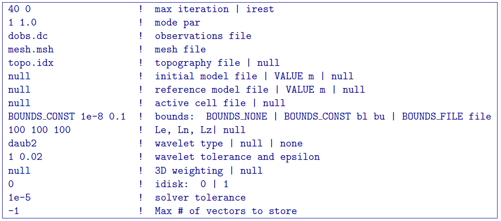

.. _dcinv:

DCoctreeInv
===========

``DCoctreeInv`` performs the inversion of the DC resistivity data over octree meshes. 

Control parameters and input files
----------------------------------

As a command line argument, ``DCoctreeInv`` requires an input file containing all parameters and files needed to carry out the inversion. The following shows the required format:

octree mesh
        Name of the octree mesh file.

LOC_XY | LOC_XYZ
        LOC_XY specifies that the electrode location file only has surface electrodes (no Z coordinate is provided), while LOC_XYZ indicates there may be a mix of surface and subsurface electrodes requiring Z locations to be assigned for each current and potential electrode in the file. This is followed by the user-defined name of the file, which contains electrode location coordinates.

initial model file | VALUE v
        The starting conductivity model can be degined as VALUE, followed by a constant "v" or as a :ref:`model file <modelfile>` for a non-uniform starting model. The latter is especially useful when a previously terminated inversion has to be restarted.

reference model file | VALUE v
        The reference conductivity model can be defined as VALUE, followed by a constant "v" or as a :ref:`model file <modelfile>` for a non-uniform reference model.

topography active cells | ALL_ACTIVE
        If there is a topography file involved in creation of the octree mesh, then the utility :ref:`create_octree_mesh <createoctreemesh>` will generate a file named active_cells.txt along with the mesh file. If there is no topography, ALL_ACTIVE can be used to indicate all cells in the model are active. 
     
model active cell | ALL_ACTIVE
        An :ref:`active cell file <activeFile>` which controls which model cells are included in the inversion. Inactive cells in the recovered model are set to the corresponding physical property value from the reference model. If you wish to solve for all model cells, then ALL_ACTIVE should be selected. 

cell weighting | NO_WEIGHT
        :ref:`File <weightsFile>` containing the cell weighting vector. If NO_WEIGHT is entered, default values of 1 are used.

interface weighting | NO_FACE_WEIGHT
        :ref:`File <weightsFile>` containing information for cell interface weighting (i.e., one weighting value for each cell interface). The utility :ref:`interface_weights <interfaceweights>` can be used to create the file. If NO_FACE_WEIGHT is entered, default values of 1 are used.

beta_max beta_min beta_factor | DEFAULT
        This line controls the selection of the initial regularization parameter (beta_max), as well as its cooling step (beta_factor) and the minimum beta value (beta_min). These values are computed automatically if the DEFAULT option is provided. However, if a previously terminated inversion has to be restarted, it is convenient to quickly resume the job as its last step by assigning these parameters manually.

alpha_s alpha_x alpha_y alpha_z
        Coefficients for each model component in the model objective function (Equation :eq:`mof1`): alpha_s is the smallest model component, alpha_x is the coefficient for the derivative in the easting direction, alpha_y is the coefficient for the derivative in the northing direction, and alpha_z is the coefficient for the derivative in the vertical direction. Some reasonable starting values might be: alpha_s=0.0001, alpha_x = alpha_y = alpha_z = 1.0. The alpha value cannot be negative and they cannot be all set equal to zero.

        NOTE: The four alpha coefficients can be of in terms of three corresponding length scales (L_x, L_y, and L_z). To understand the meaning of the length scales, consider the ratios alpha_x/alpha_s, alpha_y/alpha_s and alpha_z/alpha_s. They generally define the smoothness of the recovered model in each direction. Larger ratios result in smoother models, while smaller ratios result in blockier models. The conversion from alpha value to length scales can be done by: :math:`L_x = \sqrt{\frac{\alpha_x}{\alpha_s}}`; :math:`L_y = \sqrt{\frac{\alpha_y}{\alpha_s}}`; :math:`L_z = \sqrt{\frac{\alpha_z}{\alpha_s}}`, where length scales are defined in metres. When user-defined, it is preferable to have length scales exceed the corresponding cell dimensions.

chifact
        The chi-factor can be used to scale the data misfit tolerance. By default, a chifact=1 should be used. Increasing or decreasing the chifact is equivalent to sclaning the assigned standard deviations. An increased chifact corresponds to increased error values, which allows for a larger data misfit at convergence.

tol_nl mindm iter_per_beta
        The first parameter tol_nl defines a tolerance for the relative gradient at each :math:`\beta` step: tol_nl math:`= ||g|| / ||g_o||`, where :math:`g` is the current gradient and :math:`g_o` is the gradient at the start of the current :math:`\beta` step iteration. If the relative gradient is less than tol_nl, then the code exits the current :math:`\beta` iteration and decreases :math:`\beta` by the beta_factor.

        mindm defines the smallest allowable model perturbation (if the model perturbation :math:`\Delta m` recovered as a result of IPCH iteration is smaller than mindm, then the current :math:`\beta` iteration is terminated and :math:`\beta` is reduced by beta_factor before the next beta step.

        iter_per_beta sets the maximum number of times that the model can be updated within a given beta iteration.

tol_ipcg max_iter_ipcg
        tol_ipcg is the tolerance to which the IPCG iteration needs to solve the model perturbation. This defines how well the system :math:`J^T J + \beta W_m^T W_m` is solved.

        max_iter_ipcg defines the maximum number of IPCG iterations allowed per :math:`\beta` step to solve for the model perturbation.

CHANGE_MREF | NOT_CHANGE_MREF
        This parameter provides the optional capability to change the reference model at each beta step. If the CHANGE_MREF option is selected, then the reference model is updated every time the regularization parameter changes and is set to the last recovered model from the previous iteration. This may result in quicker convergence. If the NOT_CHANGE_MREF option is used, then the same reference model, as originally defined in line 4 is used throughout the inversion.

SMOOTH_MOD | SMOOTH_MOD_DIF
        This option is used to define the reference model in and out of the derivative terms of the model objective function (Equations :eq:`mof1` and :eq:`mof2`). The options are: SMOOTH_MOD_DIF (reference model is defined in the derivative terms of the model objective function) and SMOOTH_MOD (reference model is defined only the smallest model term of the objective function).

BOUNDS_NONE | BOUNDS CONST bl bu | BOUNDS_FILE file
        There are three options regarding the bound selection. BOUNDS_NONE lifts any boundary constraints and releases the sought parameter range to infinity. 
        
        BOUNDS_CONST followed by a lower bound (bl) and an upper bound (bu) is used in cases where there are some generalized restrictions on the recovered model properties (as is the case with chargeability, which must be fall within the range [0,1)). 
        
        BOUNDS_FILE is a more advanced option, which is followed by the name of the bounds file. This option allows the user to enforce individual bound constraints on each model cell, which can be very useful when there is reliable a priori physical property information available. This can be used as a technique to incorporate borehole measurements into the inversion or to impose more generalized estimates regarding the physical property values of known geological formations.
        

**NOTE**: Formats of the files listed in this control file are explained :ref:`here <fileformats>`.

**NOTE**: A sample input file can be obtained by executing the following line in the command prompt:

.. code-block:: rst

        DCoctreeInv -inp

**NOTE**: ``DCoctreeInv`` will terminate before the specified maximum number of iterations is reached if the expected data misfit is achieved or if the model norm has plateaued. However, if the program is terminated by the maximum iteration limit, the file DC_octree_inv_log and DC_octree_inv.out should be checked to see if the desired misfit (equal to chifact times the number of data) has been reached and if the model norm is no longer changing. If neither of these conditions have been met, then the inversion should be reevaluated.

Output files
------------

``DCoctreeInv`` saves a model after each iteration. The models are ordered: inv_01.con, inv_02.con, etc. Similarly, the predicted data is output at each iteration into a predicated data file: dpred_01.txt, dpred_02.txt, etc. The following is a list of all output files created by the program ``DCoctreeInv``:

inv.con
        Conductivity model from the latest inversion. The model is stored in :ref:`model format <modelfile>` and is overwritten at the end of each iteration.

DC_octree_inv.txt
        A log file in which all of the important information regarding the flow of the inversion is stored, including the starting inversion parameters, mesh information, details regarding the computation (CPU time, number of processors, etc), and information about each iteration (i.e., data misfit, model norm components, model norm, total objective function, norm gradient, and relative residuals at each :math:`\beta` iteration).

dpred.txt
        Predicted data from the recovered model in the latest iteration. The predicted data is in the :ref:`observation file format <dcipfile>`, with the final column corresponding to apparent conductivity (instead of standard deviation).

DC_octree_inv.out
        This file is appended at the end of each iteration and has 7 columns: 
        
        beta (value of regularization parameter)

        iter (number of IPCG iteration in a beta loop)

        misfit (data misft * 2)

        phi_d (data misfit)

        phi_m (model norm)

        phi (total objective function equal to phi_d + beta*phi_m)

        norm g (gradient equal to -RHS when solving Gauss-Newton)

        g rel (relative gradient equal to :math:`||g||/||g_o||`

mumps.log
        A diagnostic log file output by the MUMPS package.

Example files
-------------

Example of a ``DCoctreeInv`` inversion input file:

        

