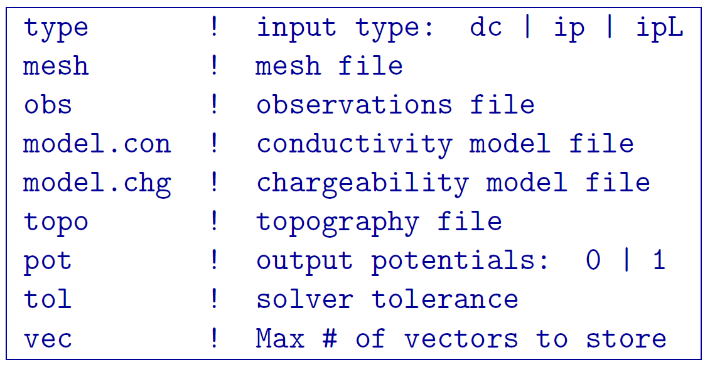
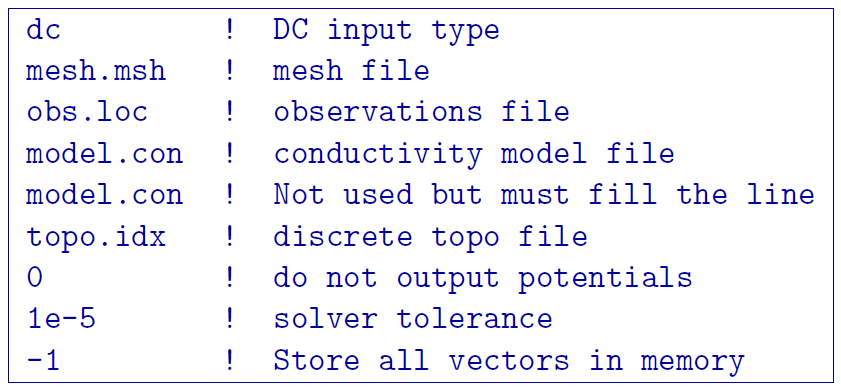

.. _fwd:

DCIPoctreeFwd
=============

This program performs the 3D forward modelling of DC resistivity and IP data over octree meshes. The parameters and files are the same for ``DCIPoctreeFwd`` and ``DCIPoctreeFwd_pardiso``.

Control parameters and input files
----------------------------------

As a command line argument, ``DCIPoctreeFwd`` requires an input file containing all parameters and files needed to carry out the forward modelling calculations. This input control file is generally named **DCIP_octree_fwd.inp** and needs to be located in the working directory, from which ``DCIPoctreeFwd`` is executed. 

The following is the input control file format:

DC | IP | IPL
        The DC option performs only DC forward modelling, while the IP option performs both DC and IP forward modelling. The IPL option calculates the IP data by multiplying the sensitivity matrix by the chargeability model. When the DC option is chosen, the chargeability model line is ignored.

octree mesh
        Name of the octree mesh file.

LOC_XY | LOC_XYZ
        LOC_XY specifies that the electrode location file only has surface electrodes (no Z coordinate is provided), while LOC_XYZ indicates there may be a mix of surface and subsurface electrodes requiring Z locations to be assigned for each current and potential electrode in the file. This is followed by the user-defined name of the file, which contains electrode location coordinates.

conductivity model
        File containing the cell values of a conductivity model in S/m.

chargeability model
        File containing the cell values of a chargeability model. Required only if the IP or IPL option is selected in the first line. This model must be provided in dimensionless units, ranging from [0,1).

topography active cells | ALL_ACTIVE
        If there is a topography file involved in creation of the octree mesh, then the utility :ref:`create_octree_mesh <createoctreemesh>` will generate a file named active_cells.txt along with the mesh file. If there is no topography, ALL_ACTIVE can be used to indicate all cells in the model are active. 
     
**NOTE**: Formats of the files listed in this control file are explained :ref:`here <fileformats>`.

Output files
------------

data_dc.txt
        The DC potential data

[data_ip.txt]
        The IP data (only if the IP or IPL option was set in the input file)

model.con | model0.chg
        The conductivity and/or chargeability model that was used for forward modelling but now wwith the air cells removed.

DCIP_octree_fwd.log
        Log file which provides details about the parameters used in the forward modelling and diagnostic information about the results.

[mumps.txt]
        Depending on the version of the code used, a diagnostic log file will be output by the MUMPS package.

Example files
-------------

Example of a forward modelling input file:

