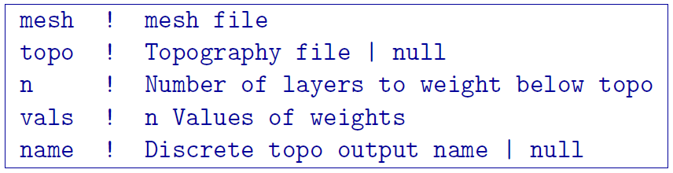

.. _interfaceweights:

interface_weights
=================

This utility is designed to build an interface weighting file which can be particularly useful if you know the location of a sharp boundary within your model that has a large physical property contrast across it. This utility looks at the physical property gradient across all cell faces within the input model and assigns a small interface weight (less than 1) if the gradient is above a specified tolerance. Assigning the small interface weight (less than 1) forces a sharp contrast. This utility is also used to smooth surface variations laterally by placing large weights (greater than 1) on the topographic surface.

The utility can be called from the command prompt as follows:

.. code-block:: rst
	
		interface_weights weight.inp

This utility works with an arbitrary input control file name and does not have to be "weight.inp".

Control parameters and input files
----------------------------------

The following shows the control file format:

input octree mesh
	Input octree mesh on which the topography active cell file and input octree model are defined

topography active cell | ALL_ACTIVE
	Input active cell file which defines topography. ALL_ACTIVE can be selected if there is no topography and model cells are active.

input octree model | NO_MODEL
	Input octree model used to calculate the physical property gradient across all cell faces. The NO_MODEL option is used if only surface interface weights are desired.

LOG_MODEL | LIN_MODEL
	Linear versus logarithmically scaled model file. LOG_MODEL is typically used for DC conductivity model while LIN_MODEL is usually used for IP chargeability models.

gradtol
	Gradient tolerance above which to assign an interface weight of values "weightedge" to the cell interface. In the above example input file, this was set to 1e-3.

weightedge
	Interface weight to assign to cell interfaces with a large physical property gradient, which exceeds "gradtol". Small weight values (less than 1) will force a sharper contact. In the above example input file, this was set to 0.01.

# of surface layers
	An integer that defines the number of surface layers that you would like to apply weights to. Each layer is a single cell in thickness. Since cell thickness will vary throughout the octree model, the layers are defined on the core region of the model where the smallest cells are. The interface weights are then assigned based on where the top southwest corner of the cell falls (i.e., for a large padding cell near the edge of the octree model, the topmost cell might be ten times ticker than the smallest surface cell in the core region. In this case, this entire cell would be assigned the weight of the surface layer. All of the cells beneath this edge cell would remain unweighted though, because the top SW corner lies below the depth of the second and third layers, as defined by the smaller surface cells in the core region of the model.) In the above example input file, this was set to 3.

interface weight values
	One interface weight value is required for each of the surface layers. This defines a lateral interface weight for the near-surface cells. As these lateral interface weights are increased, so does the degree of lateral smoothing. In the above example input file, 3 surface layers were set so 3 interface weight values are required. The above example file shows those as 200, 100, and 50.

output face weight file
	The desired name for the output file with the interface weights.

Output files
------------

output face weight
	Output interface weighting file which contains three interface weighting vectors: :math:`w_x`, :math:`w_y`, and :math:`w_z`. These vectors are listed in a single column with :math:`w_x` first, then :math:`w_y`, and finally :math:`w_z`.