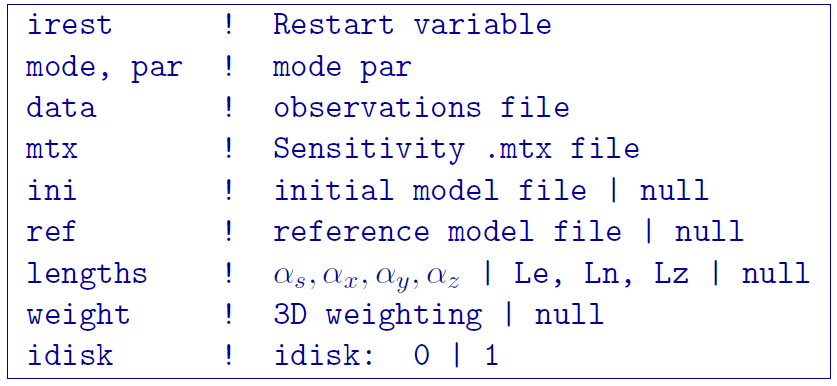
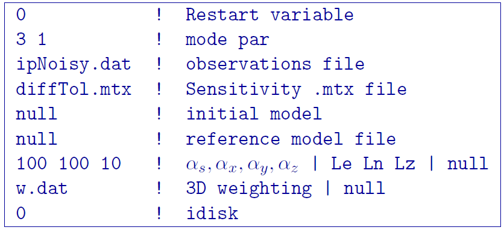

.. _ipinv:

IPInv3D
===========

This program performs the inversion of induced polarization data. Command line usage:

.. code-block:: rst

        ipinv3d ipinv.inp

For the control file ``ipinv.inp`` described below.

Control parameters and input files
----------------------------------

The bounds for version 5.0 have NOT been added for IP data inversion. Positivity is enforced through the log-barrier method. The format for the main IP inversion input file is:

irest
        An integer specifying how to start the inversion. There are two choices:

        1. irest=0 Begins the inversion from scratch

        2. irest=1 Restarts the inversion from a previous iteration. The files ``ipinv3d.aux`` and ``ipinv3d.eta`` must be present for this option.

mode,par
        An integer specifying one of the two choices for determining the trade-off parameter (a real value):

                1. mode=1: the program chooses the trade off parameter by carrying out a line search so that the target value of data misfit is achieved (e.g.,  :math:`\phi_d= N`). the target misfit value is given by the product of par and the number of data, N. Normally, the value of par should be 1.0 if the correct standard deviation of error is assigned to each datum.

                2. mode=2: the user inputs the trade off parameter as defined by par.

                3. mode=3: the program calculates the trade-off parameter using generalized cross validation (GCV) and par is ignored

data
        The DC observation locations (with standard deviations).

mtx
        A matrix file (.mtx) file from ``IPSEN3D``.

ini
        A chargeability model file or null to set the initial model to 0.05 if IPTYPE=1 or 0.01 ifIPTYPE=2. **The initial model must be non-zero.**

ref
       chargeability model file or null to set the reference model to 0.

lengths
        Coefficients for the each model component for the model objective function from equation 12. :math:`\alpha_s` is the smallest model component. :math:`\alpha_x` Coefficient for the derivative in the easting direction. :math:`\alpha_y` is the coefficient for the derivative in the northing direction. The coefficient :math:`\alpha_z` is for the derivative in the vertical direction.
        If null is entered on this line, then the above four parameters take the following default values: :math:`\alpha_s` = 0:0001; :math:`\alpha_x` = :math:`\alpha_y` = :math:`\alpha_z` = 1:0. None of the alpha's can be negative and they cannot be all equal to zero at the same time.
        NOTE: The four coefficients :math:`\alpha_s`, :math:`\alpha_x`, :math:`\alpha_y` and :math:`\alpha_z` can be substituted for three corresponding length scales Lx, Ly and Lz. To understand the meaning of the length scales, consider the ratios :math:`L_x = \sqrt{\frac{\alpha_x}{\alpha_s}}`; :math:`L_y = \sqrt{\frac{\alpha_y}{\alpha_s}}`; :math:`L_z = \sqrt{\frac{\alpha_z}{\alpha_s}}`. They generally define smoothness of the recovered model in each direction. Larger ratios result in smoother models, smaller ratios result in blockier models. The conversion from 's to length scales can be done by:

        .. math::
                L_x = \sqrt{\frac{\alpha_x}{\alpha_s}}; L_y = \sqrt{\frac{\alpha_y}{\alpha_s}}; L_z = \sqrt{\frac{\alpha_z}{\alpha_s}}
                :label: length_scale_ip

        where length scales are defined in meters. When user-defined, it is preferable to have length scales exceed the corresponding cell dimensions.

weight
        Name of the file containing weighting matrix. If null is entered, the default value of one is used for no extra weighting.

idisk
        Integer flag of zero or one to write the sensitivities to disk

                1. idisk=0: Store the entire sensitivity matrix in memory. This option will be desired in almost all cases.

                2. idisk=1: Access the sensitivity matrix from memory when needed

**NOTE**: Formats of the files listed in this control file are explained :ref:`here <fileformats>`.

**NOTE**: A sample input file can be obtained by executing the following line in the command prompt:

.. code-block:: rst

        ipinv3d -inp

**NOTE**: ``IPInv3D`` will terminate before the specified maximum number of iterations is reached if the expected data misfit is achieved or if the model norm has plateaued. However, if the program is terminated by the maximum iteration limit, the file IP_octree_inv_log and IP_octree_inv.out should be checked to see if the desired misfit (equal to chifact times the number of data) has been reached and if the model norm is no longer changing. If neither of these conditions have been met, then the inversion should be reevaluated.

Output files
------------

``IPInv3D`` saves a model after each iteration. The models are ordered: inv_01.con, inv_02.con, etc. Similarly, the predicted data is output at each iteration into a predicated data file: dpred_01.txt, dpred_02.txt, etc. The following is a list of all output files created by the program ``IPInv3D``:

ipinv3d.log
        The log file containing the minimum information for each iteration and summary of the inversion.

ipinv3d.aux
        An auxiliary file to allow the program to restart (Required for restart).

ipinv3d.eta
        Values of :math:`\eta` so that the program can restart (Required for restart).

ipinv3d iter.sus
        Chargeability files output after each iteration (iter defines the iteration step).

ipinv3d iter.pre
        Predicted data files output after each iteration (iter defines the iteration step).

ipinv3d.pre
        Predicted data file that is updated after each iteration (will also be the "final" predicted data)

ipinv3d.chg
        Chargeability model that matches the predicted data file and is updated after each iteration (will also be the "final" recovered model)

Example files
-------------

This example of an IP inversion input file starts the inversion from scratch and performs GCV to find the trade-off parameter. The sensitivity matrix file was renamed to ``diffTol.mtx`` so the use new that they had used a different tolerance (and so they could switch to the other matrix file without re-running ``IPSEN3D``). The initial model is set to null and depends upon the IP data type. The ref rence model was zero. Length scales were given to drive the recovered chargeabilities to more layered geometry. Additional weighting was applied through the file ``w.dat``, supplied by the user.

