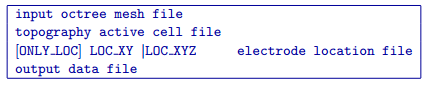

.. _surfaceelectrodes:

surface_electrodes
==================

This utility is designed to drape the existing surface electrode survey geometry onto a user-provided 3D topographic surface. This essentially takes a LOC_XY location file and interpolates the defined topographic surface to determine the Z location of each electrode on the topographic surface. The electrode locations are then output in a LOC_XYZ location file. Use the following command in a command prompt:

.. code-block:: rst

  surface_electrodes
  
This utility requires a control file surface_electrodes.inp to exist in the working directory. The control file name cannot be changed by the user.

Control parameters and input files
----------------------------------

The following is the control file format:

  
The file contains the following parameters:

input octree mesh file
  Input octree mesh on which the topography active cells are defined.
  
topography active cell file
  Input active cell model which defines the topography.

[ONLY_LOC] LOC_XY | LOC_XYZ
  Input DC/IP observation file. If the ONLY_LOC option is specified, a locations file is required instead of an observation file.

output data file
  Desired filename for the generated observations/locations file, in which the electrodes have been draped onto the topographic surface.

Output files
------------

output data file
  Observations/locations file in LOC_XYZ format, using the filename specified in the input file. The electrode have been draped onto the topographic surface.
  
.. note:: If a LOC_XYZ observations or locations file is specified in the input control file, electrodes above the surface will be draped to the surface, while electrode locations below the surface will remain unchanged.
