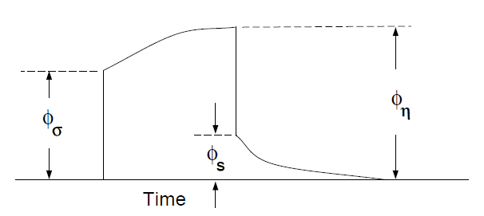
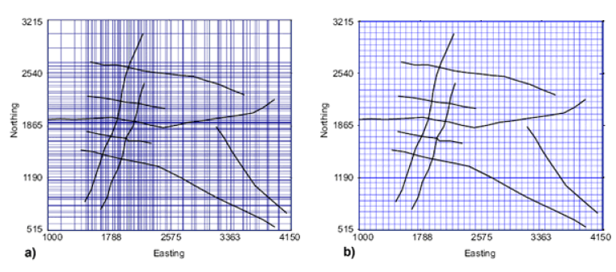
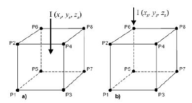
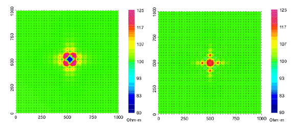

.. _theory:

Background theory
=================

Introduction
------------

This manual  presents  theoretical  background,  numerical  examples,  and  explanation  for implementing the program library DCIP3D. This suite of algorithms, developed at `UBC-GIF <gif.eos.ubc.ca>`__, is needed to efficiently invert large sets of DC potential data and IP responses over a 3D earth structure. The manual is designed so that a geophysicist who has understanding of DC resistivity and induced polarization field experiments, but who is not necessarily versed in the details of inverse theory, can use the codes to invert his or her data.

        Definition of three potentials associated with DC/IP experiments.

A typical DC/IP experiment involves inputting a current :math:`I` to the ground and measuring the potential away from the source.  In a time-domain system, the current alternates in direction and has off-times between the current pulses at which the IP voltages are measured. A typical time-domain signature is shown in :numref:`potentials`. In that figure, :math:`\phi_\sigma` is the potential that is measured in the absence of chargeability effects. This is the instantaneous value of the potential measured when the current is turned on. In mathematical terms, this potential is related to the electrical conductivity :math:`\sigma` by:

.. math::
        \phi_\sigma = \mathcal{F}_{dc}[\sigma]

where forward mapping operator :math:`\mathcal{F}_{dc}` is defined by the equation:

.. math::
        \nabla\cdot(\sigma\nabla \phi_\sigma)=-I\delta(\mathbf{r}-\mathbf{r}_s)
        :label: DC

and appropriate  boundary  conditions.	In Equation :eq:`DC`, :math:`\sigma` is  the  electrical  conductivity  in Siemens/meter (S/m), :math:`\nabla` is the gradient operator, math:`I` is the strength of the input current in Amperes (A), and :math:`\mathbf{r}_s` is the location of the current source.  For typical earth structures, :math:`\sigma`, while positive, can vary over many orders of magnitude. The potential in Equation :eq:`DC` is the potential due to a single current. This is the value that would be measured in a pole-pole experiment. If potentials from pole-dipole or dipole-dipole surveys are to be generated then they can be obtained by using Equation :eq:`DC` and the principle of superposition.

When the earth material is chargeable, the measured voltage will change with time and reach a limit value which is denoted by :math:\phi_\eta: in :numref:`potentials`. There are a multitude of microscopic polarization phenomena which when combined produce this response but all of these effects can be consolidated into a single macroscopic parameter called chargeability. We denote chargeability by the symbol :math:`\eta`. Chargeability is dimensionless, positive, and confined to the region [0,1).

To carry out forward modelling to compute :math:`\phi_{\eta}`, we adopt the formulation of :cite:`seigel1959mathematical` which states that the effect of a chargeable ground is modelled by using the DC resistivity forward mapping :math:`\mathcal{F}_{dc}` but with the conductivity replaced by :math:`\sigma=\sigma(1-\eta)`. Thus:

.. math::
        \phi_\eta=\mathcal{F}_{dc}[\sigma(1-\eta)]
        :label: Phieta

or

.. math::
        \nabla\cdot(\sigma(1-\eta)\nabla\phi_\eta)=-I\delta(\mathbf{r}-\mathbf{r}_s)
        :label: chargeability

The IP datum can be either the secondary potential (:math:`\phi_s`) or the apparent chargeability (:math:`\eta_a`). The former is the difference of the forward modelled potentials with, and without, the IP effect:

.. math::
        \phi_s=\phi_\eta-\phi_\sigma=\mathcal{F}_{dc}[\sigma(1-\eta)]-\mathcal{F}_{dc}[\sigma]
        :label: potentialsdiff

The apparent chargeability is then given by the ratio:

.. math::
        \eta_a=\frac{\phi_s}{\phi_\eta}=\frac{\mathcal{F}_{dc}[\sigma(1-\eta)]-\mathcal{F}_{dc}[\sigma]}{\mathcal{F}_{dc}[\sigma(1-\eta)]}
        :label: potentialsfrac

In this definition, the apparent chargeability is dimensionless and, in the case of data acquired over an earth  having constant chargeability :math:`\eta_0`, we have :math:`\eta_a=\eta_0`. Equations :eq:`potentialsdiff` and :eq:`potentialsfrac` show that the IP data can be computed by carrying out two DC resistivity  forward modellings with conductivities :math:`\sigma` and :math:`\sigma(1-\eta)`. The secondary potential is the more general form of IP data and the apparent chargeability is only defined when the linear (or polar) arrays are used along a line on the surface or in the same borehole. When the current and potential dipole-electrodes are arranged in 3D space and so they are not aligned, the total potential can take on positive, zero, or negative values.  The cross-line experiments on the surface and cross-hole experiment on boreholes are examples of such situations.  Because of the zero-crossing in the total potentials, the commonly used apparent chargeability is undefined. In these cases, the appropriate data to measure the IP effect is the secondary potential. Therefore, we will use secondary potential as the basic IP datum except in the case of linear arrays.

The field data from a DC/IP survey are a set of N potentials (ideally :math:`\phi_\sigma`, but usually :math:`\phi_\eta`) and a set of N secondary potentials :math:`\phi_s` or a quantity that is related to :math:`\phi_s`. The goal of the inversionist is to use these data to acquire quantitative information about the distribution of the two physical parameters of interest:  conductivity :math:`\sigma(x,y,z)` and chargeability :math:`\eta(x,y,z)`.

The distribution of conductivity and chargeability in the earth can be extremely complicated. Both quantities vary as functions of position in 3D space. In addition, there is often large topographic relief. In this program library, the 3D nature of the physical properties and surface topography are fully incorporated. The Earth model is divided into prismatic cells each having a constant value of conductivity and chargeability. The surface topography is approximated by a piecewise constant surface.

Forward modelling
-----------------

The forward modelling for the DC potentials and IP apparent chargeabilities is accomplished using a finite volume method :cite:`dey1979resistivity` and a pre-conditioned conjugate gradient technique to solve Equation :eq:`DC`. The program that performs these calculations is ``DCIPF3D``. The DC modelling is performed by a single solution  of Equation :eq:`DC`. In Version 5.0 we include the option to calculate IP data by multiplying the sensitivity matrix :math:`\mathbf{J}` by the chargeability provide by user. That is, we forward model with the linear equations that will be used for the inve sion. The chargeability in this case can have arbitrary units. The forward modelled data are calculated as:

.. math::
        \mathbf{d_{ip}} = \mathbf{J}_{ip} \eta
        :label: data_ip

where :math:`\mathbf{d_{ip}}` is the IP data and :math:`\mathbf{J}_{ip}` is the sensitivity matrix for the IP problem, given DC data, :math:`\mathbf{d}_{dc}`. Forward modelling using equation :eq:`sensitivity_ip` is further explained in the section 2.5.

.. math::
        \mathbf{J}_{ip} = -\frac{\partial \ln \phi_{\eta}}{\partial \ln \sigma} = -\frac{1}{\sigma_{\eta}} \frac{\partial \phi_{\eta}}{\partial \ln \sigma} = -\frac{1}{\mathbf{d}_{dc}}\mathbf{J}_{dc}
        :label: sensitivity_ip

        Mesh design with ``DCIP3D``. Current and potential electrodes are located on the solid lines. (a) Version 1.0 required electrodes be placed on cell nodes. (b) Update versions allow for the electrodes to be placed anywhere.

The forward (and inversion) code uses a nodal-based finite volume technique in which the current is input on a node. This is an important change from the original version of DCIP3D and is illustrated in Figure 2. When inverting field data, the usual procedure is to generate a mesh whose nodes coincide with the location of the current electrodes. The difficulty with accomplishing this task is illustrated in Figure :numref:`meshdesign` a. The left panel is an attempt to design a mesh that  permits each  electrode to be on a node. The number of cells required to accomplish this is large and the aspect ratio are undesirable. High aspect ratios of cells reduces the numerical accuracy and also reduces the peed at which the forward modeling equations can be solved. This problem is greatly exacerbated when field surveys are carried out in regions of considerable topography. It would be preferable to have a uniform gridding in which the cell size is dictated by the resolving power of the data rather than by small details regarding exact placement of electrodes. A desired grid is shown in Figure :numref:`meshdesign` b.

To handle a current electrode that is at an arbitrary position :math:`(x_s; y_s; z_s)` in the cell we made a modification to distribute any current amongst the 8 nodes of the cell. This approach is shown in Figure 3, where a current I is distributed onto nodes P1 through P8. Effectively, we write

.. math::
        \mathbf{I}\delta(r_s) \approx {\sum_{i=1}}^8 \mathbf{I} w_i(r_i, r_s) \delta(r_i)
        :label: electrodes_relocation

where :math:`r_s = (x_s; y_s; z_s)` is the position of the current electrode, :math:`r_i = (x_i; y_i; z_i)` is the position of the ith node, and :math:`w_i` is the linear-interpolation weighting for the ith node:

.. math::
        {\sum_{i=1}}^8 w_i = 1
        :label: electrode_relocation_weight

so that the total current distributed among the 8 nodes is equal to :math:`\mathbf{I}`. With the linear interpolation we note that if the source electrode is on one of the faces of the cell, then only 4 nodes will be activated. If the source electrode is along an edge then the current is distributed between two nodes, and if the source electrode is at a corner of the prism, then only one node is activated. If potential electrodes are not on the nodes then fields are linearly interpolated.

        Current electrode can be placed at an arbitrary position :math:`(x_s; y_s; z_s)` within a cell, or on a node. The currents are distributed to each node of the cell through linear interpolation.

        Forward modeled apparent resistivities of a halfspace showing differences between placing the current electrode at (a) cell centers versus (b) cell nodal points.

As an example of the importance of the interpolation, a halfspace is modeled in which the cell
size is 50 m and a current is injected at the surface in the center of the cell. Potentials are obtained on a 25-m grid. Apparent resistivities should equal 100 Ohm-m, which is the true halfspace value. The results are shown in Figure :numref:`forwardmodel` a. Errors up to 25% are observed at locations that are 25 m (1/2 cell) from each of the four corners where the distributed current is input. At distances 50 m (one cell width) the error has dropped to about 7%. These are expected results and are in accordance with testing using the first version of ``DCIP3D``. In Figure :numref:`forwardmodel` b the apparent resistivities for a current on a nodal location are plotted. At a distance of 50 m from the current, the error is less than 5% if with on a nodal discretization. The errors increase somewhat between distances of one and two cells. We conclude that for numerical accuracies of about 5% or less, the observation should be at least one cell width away from the location of a current electrode.

General inversion methodology
-----------------------------

The computing programs outlined in this manual solve two inverse problems. In the first we invert the DC potentials :math:`\phi_{\sigma}` to recover the electrical conductivity :math:`\sigma(x; z)`. This is a non-linear inverse problem that requires linearization of the data equations and subsequent iteration steps. After DC data have been inverted, the conductivity model is used to invert the IP data to recover the chargeability :math:`\eta(x; z)`. Because chargeabilities are usually small quantities (:math:`\eta<0:3`) it is possible to linearize equation :eq:`potentialsfrac` and derive a linear system of equations to be solved. Irrespective of which data set is being inverted however, we basically use the same methodology to carry out the inversions. We outline this methodology here.

The inverse problem is formulated as an optimization problem where an objective function of the model is minimized subject to the constraints in Equation :eq:`DC` for DC resistivity data or Equation :eq:`chargeability` for IP data. To outline our methodology, it is convenient to introduce a single notation for the data and for the model. We let :math:`\mathbf{d} = (d_1,d_2,...,d_N)^T` denote the data, where :math:`N` is the number of data. Using this notation, :math:`d_i` is either the :math:`i^{th}` potential in a DC resistivity data set, or the :math:`i^{th}` secondary potential/apparent chargeability in an IP survey. Let the physical property of interest be denoted by the generic symbol :math:`m` for the model element. The quantity :math:`m_i` denotes the conductivity or chargeability of the :math:`i^{th}` model cell. For the inversion, we choose :math:`m_i=\ln(\sigma_i)` when inverting for conductivities, and :math:`m_i=\eta_i` when reconstructing the chargeability distribution.

The goal of the inversion is to recover a model vector :math:`\mathbf{m} = (m_1,m_2,...,m_m)^T` , which acceptably reproduces the n observations of :math:`\mathbf{d}`. Importantly, the data are noise contaminated, therefore we don't want to fit them precisely. A perfect fit in our case would be indicative, that incorrect earth model is recovered, as some features observed in the constructed model would assuredly be artifacts of the noise. Therefore, the inverse problem is formulated as an optimization problem where a global objective function,  :math:`\Phi`, is minimized. The global objective functions consists of two components: a model objective function,  :math:`\Phi_m`, and a data misfit function, :math:`\Phi_d`, such that:

.. math::
        \min \Phi = \Phi_d+\beta\Phi_m \\
        \mbox{s. t. } \Phi_{d}=\Phi_{d}^* \text{and optionally} ~ m^l\leq m\leq m^u, \nonumber
        :label: globphi

where :math:`\beta` is a trade-off parameter that controls the relative importance of the model smoothness through the model objective function and data misfit function. When the standard deviations of data errors are known, the acceptable misfit is given by the expected value  d and we will search for the value of :math:`\beta` via an L-curve criterion :cite:`hansen2000curve` that produces the expected misfit at each linearized step (see section 2.4). Otherwise, a user-defined value is used. Bound are imposed through the projected gradient method so that the recovered model lies between imposed lower :math:`\mathbf{m}^l` and upper :math:`\mathbf{m}^u` bounds.

The details of the objective function are problem dependent but generally we need the flexibility to be close to a reference model :math:`\mathbf{m}_o` and also require that the recovered model be relatively smooth in all three spatial directions. Here we adopt a right-handed Cartesian coordinate system with :math:`y` positive north and and :math:`z` positive up. In defining the model objective function, the reference model will generally be included in the first component of the objective function but it can be removed, if desired, from the remaining derivative terms since we are often more confident in specifying the value of the model at a particular point than in supplying an estimate of the gradient. This leads to the following two distinct formulations of the model objective function.

.. math::
        \Phi_m =  &&\alpha_s\int\int\ w_s(\mathbf{m}-\mathbf{m}_0)^2dv + \alpha_x\int\int w_x\left(\frac{\partial{(\mathbf{m}-\mathbf{m}_0)}}{\partial x}\right)^2dv+ \nonumber \\
        &&\alpha_y\int\int w_y\left(\frac{\partial{(\mathbf{m}-\mathbf{m}_0)}}{\partial y}\right)^2 dv + \alpha_z\int\int\ w_z\left(\frac{\partial{(\mathbf{m}-\mathbf{m}_0)}}{\partial z}\right)^2dv,
        :label: mof1

.. math::
        \Phi_\mathbf{m} =  &&\alpha_s\int\int\ w_s(\mathbf{m}-\mathbf{m}_0)^2dv + \alpha_x\int\int w_x\left(\frac{\partial{\mathbf{m}}}{\partial x}\right)^2dv+ \nonumber \\
        &&\alpha_y\int\int w_y\left(\frac{\partial{\mathbf{m}}}{\partial y}\right)^2 dv + \alpha_z\int\int\ w_z\left(\frac{\partial{\mathbf{m}}}{\partial z}\right)^2dv,
        :label: mof2

where the weighting functions :math:`w_s`, :math:`w_x`, :math:`w_y` and :math:`w_z` are spatially dependent, and :math:`\alpha_s`, :math:`\alpha_x`, :math:`\alpha_y` and :math:`\alpha_z` are coefficients which affect the relative importance of different components in the model objective function. The reference model :math:`m_o` may be a general background model that is estimated from previous investigations or it could be a zero model. The purpose of the generalized weighting functions are to place emphasis throughout the model to utilize prior information.

The objective function in equations :eq:`mof1` and :eq:`mof2` has the flexibility to incorporate many types of prior knowledge into the inversion. The reference model may be a general background model (e.g., background conductivity) that is estimated from previous investigations or it will be a zero model (in terms of chargeability). The reference model would generally be included in the first component of the objective function but it can be removed if desired from the remaining terms; often we are more confident in specifying the value of the model at a particular point than in supplying an estimate of the gradient.

The relative closeness of the final model to the reference model at any location is controlled by the function :math:`w_s`. For example, if the interpreter has high confidence in the reference model at a particular region, he can specify :math:`w_s` to have increased amplitude there compared to other regions of the model. The interface weighting functions :math:`w_x`, :math:`w_y`, and :math:`w_z` can be designed to enhance or attenuate structures in various regions in the model domain. If geology suggests a rapid transition zone in the model, then a decreased weighting for flatness can be put there and the constructed model will exhibit higher gradients provided that this feature does not contradict the data.

To perform a numerical solution, we discretize the model objective functions in Equations :eq:`mof1` and :eq:`mof2` using a finite difference approximation on the mesh defining the conductivity/chargeability model. This yields:

.. _mof:

.. math::
        \Phi_m(\mathbf{m})&=&(\mathbf{m}-\mathbf{m}_o)^T(\alpha_s \mathbf{W}_s^T\mathbf{W}_s+\alpha_x \mathbf{W}_x^T\mathbf{W}_x+\alpha_y \mathbf{W}_y^T\mathbf{W}_y+\alpha_z \mathbf{W}_z^T\mathbf{W}_z)(\mathbf{m}-\mathbf{m}_o), \nonumber\\
        &\equiv&(\mathbf{m}-\mathbf{m}_o)^T(\mathbf{W}_m^T\mathbf{W}_m)(\mathbf{m}-\mathbf{m}_o), \nonumber\\
        &= &\left \| \mathbf{W}_m(\mathbf{m}-\mathbf{m}_o) \right \|^2,
        :label: modobjdiscr1

for Equation :eq:`mof1` and the following for Equation :eq:`mof2`.

.. math::
        \Phi_m(\mathbf{m}) & = &(\mathbf{m}-\mathbf{m}_o)^T(\alpha_s \mathbf{W}_s^T\mathbf{W}_s)(\mathbf{m}-\mathbf{m}_o)+\mathbf{m}^T(\alpha_x \mathbf{W}_x^T\mathbf{W}_x+\alpha_y \mathbf{W}_y^T\mathbf{W}_y+\alpha_z \mathbf{W}_z^T\mathbf{W}_z)\mathbf{m}, \nonumber\\
        &\equiv&(\mathbf{m}-\mathbf{m}_o)^T(\mathbf{W}_s^T\mathbf{W}_s)(\mathbf{m}-\mathbf{m}_o)+\mathbf{m}^T\mathbf{W}^T\mathbf{W}\mathbf{m},
        :label: modobjdiscr2

where :math:`\mathbf{m}` and :math:`\mathbf{m}_o` are :math:`M`-length discretized model vectors which characterize the conductivity/chargeability distributions within the current model and reference model, respectively. The individual matrices :math:`\mathbf{W}_s` , :math:`\mathbf{W}_x`, :math:`\mathbf{W}_y`, and :math:`\mathbf{W}_z` are straight-forwardly calculated once the model mesh and the weighting functions :math:`w_s` , :math:`w_x`, :math:`w_y`, :math:`w_z` are defined. The cumulative matrix :math:`\mathbf{W}_m^T\mathbf{W}_m` is then formed.

Having chosen an appropriate model objective function the next step in setting up the inversion is to define a data misfit measure. Here we use the :math:`l_2`-norm measure:

.. math::
        \Phi_d = \left\| \textbf{W}_d(\textbf{d}-\textbf{d}^{obs})\right\|^2_2
        :label: phid

and assume that the contaminating noise in the data is independent and Gaussian with zero mean. Specifying :math:`\mathbf{W}_d` to be a diagonal datum weighting matrix whose :math:`i^{th}` element is :math:`1/\epsilon_i`, where :math:`\epsilon_i` is the standard deviation of the :math:`i^{th}` datum, makes :math:`\Phi_d` a chi-squared variable distributed with :math:`N` degrees of freedom. Accordingly :math:`E[\chi^2]=N` provides a target misfit for the inversion. We now have the components to solve the inversion as defined in equation :eq:`globphi`.

To solve the optimization problem when constraints are imposed we use the projected gradients method (:cite:`calamai1987projected` ; :cite:`vogel2002computational` ). This technique forces the gradient in the Krylov sub-space minimization (in other words a step during the conjugate gradient process) to zero if the proposed step would make a model parameter exceed the bound constraints. The result is a model that reaches the bounds, but does not exceed them.

Inversion of DC resistivity data
--------------------------------

The program library DCIP3D provides a DC resistivity inversion program, ``DCInv3D``. The inversion of DC resistivity data, formulated as the minimization of the global objective function (see Equation :eq:`globphi`), is nonlinear since the data do not depend linearly upon the conductivity model. A Gauss-Newton approach is used in which the objective function is linearized about a current model, :math:`\mathbf{m}^{(n)}`, a model perturbation is computed, and then used to update the current model. Substituting :math:`\mathbf{m}^{(n+1)}=\mathbf{m}^{(n)}+\delta\mathbf{m}` into the global objective function (Equation :eq:`globphi`) gives:

.. math::
        \phi(\mathbf{m}+\delta\mathbf{m})=\left \| \mathbf{W}_d(\mathbf{d}^{(n)}+\mathbf{J}\delta\mathbf{m}-\mathbf{d}) \right \|^2+\beta\left \| \mathbf{W}(\mathbf{m}+\delta\mathbf{m}- \mathbf{m}_0) \right \|^2+H.O.T
        :label: HOT

where :math:`\mathbf{J}` is the sensitivity matrix and the element :math:`J_{ij}` quantifies the influence of the model change in j-th cell on the i-th datum,

.. math::
        J_{ij}=\frac{\partial d_i}{\partial m_j}=\frac{\partial \phi_i}{\partial ln(\sigma_i)}
        :label: sensitivity

Neglecting the higher order terms (H.O.T.) and setting to zero the derivative with respect to :math:`\delta\mathbf{m}` yields the following system to solve for the model objective function (Equation :eq:`mof1`) used when the ``SMOOTH_MOD_DIF`` parameter is specified in the inversion input control file:

.. math::
        (\mathbf{J}^T\mathbf{J}+\beta \mathbf{W}_m^{T}\mathbf{W}_m)\delta\mathbf{m} = -\mathbf{J}^T(\mathbf{d}^{(n)}-\mathbf{d})-\beta \mathbf{W}_m^T\mathbf{W}_m(\mathbf{m}^{(n)}-\mathbf{m}_0)
        :label: solution

where :math:`\mathbf{W}_m^T\mathbf{W}_m` is defined by Equation :eq:`modobjdiscr1`.

Similarly, the following system arises when the model objective function (Equation :eq:`mof2`) is used (i.e. the ``SMOOTH_MOD`` parameter is specified in the inversion input control file):

.. math::
        (\mathbf{J}^T\mathbf{J}+\beta(\mathbf{W}_{s}^{T}\mathbf{W}_{s}+\mathbf{W}^{T}\mathbf{W}))\delta\mathbf{m} = -\mathbf{J}^T(\mathbf{d}^{(n)}-\mathbf{d})-\beta(\mathbf{W}_{s}^T\mathbf{W}_{s}(\mathbf{m}^{(n)}-\mathbf{m}_0)+\mathbf{W}^{T}\mathbf{W}\mathbf{m})
        :label: solution2

In these formulations we assume that the matrix :math:`\mathbf{W}_d` has been absorbed into the sensitivity matrix and data vectors. By solving either of these inverse problems you obtain the model perturbation, which then allows you to generate a new model according to the following relation:

.. math::
        \mathbf{m}^{(n+1)}=\mathbf{m}^{(n)} + \alpha \delta \mathbf{m},
        :label: perturbation

where :math:`\alpha` in (0,1] limits the step size and is chosen to ensure that the total objective function is reduced.

The major computational effort in this approach includes the calculation of the sensitivity matrix, solution of the basic linearized Equation :eq:`solution`, and the choice of regularization parameter :math:`\beta`. The sensitivity is computed using the standard adjoint equation approach, and Equation :eq:`solution` or :eq:`solution2` is solved using a pre-conditioned conjugate gradient (CG) technique, in which the sensitivity matrix :math:`\mathbf{J}` is applied to vectors by sparse multiplications in the wavelet domain after it is compressed using fast wavelet transform.

Inversion of IP data
--------------------

To invert IP data it is necessary to linearize Equation :eq:`potentialsdiff`. Let :math:`\eta_i` and :math:`\sigma_i` denote the chargeability and electrical conductivity of the :math:`i^{th}` model cell. Linearizing the potential :math:`\phi_\eta` about the conductivity model :math:`\sigma` yields:

.. math::
        \phi_\eta=\phi(\sigma-\eta \sigma)=\phi(\sigma)-\sum_{j=1}^{M}\frac{\partial  \phi}{\partial \sigma_j}\eta_j\sigma_i+H.O.T
        :label: potentialin

Substituting into Equation :eq:`potentialsdiff` yields:

.. math::
        \phi_s=\phi_\eta-\phi_\sigma=-\sum_{j=1}^{M}\frac{\partial  \phi}{\partial \sigma_j}\eta_j\sigma_i+H.O.T
        :label: potentialsums

When apparent chargeability is used as the IP data, substituting the above equation into Equation :eq:`potentialsfrac`, yields:

.. math::
        \eta_a=-\sum_{j}\frac{\sigma_j}{\phi_i}\frac{\partial  \phi_i}{\partial \sigma_j}\eta_j =-\sum_{j}\sigma_j\frac{\partial ln(\phi)}{\partial ln(\sigma_j)}\eta_j
        :label: etaa

Thus the :math:`i^{th}` datum (either secondary potential or apparent chargeability) is exposed as:

.. math::
        d_i=\sum_{j=1}^{M}J_{ij}\eta_{ij}
        :label: sum

where

.. math::
        J_{ij} =
        \left\{
        \begin{array}{cl}
        \frac{\partial \phi_i \left[ \sigma \right]}{\partial ln\sigma_j}, \mathbf{d}=\phi_s\\
        \\
        \frac{\partial ln\phi_i\left [ \sigma \right ]}{\partial ln\sigma_j}, \mathbf{d}=\eta_a
        \end{array}
        \right\}
        :label: Jij

is the sensitivity matrix.

The general problem takes the form of d = Jm and can be solved as described in section 2.3. Bound constraints (e.g., positivity) for IP are imposed through projected gradients (:cite:`calamai1987projected` ; :cite:`vogel2002computational` ). The sensitivity matrix is dense and thus wavelets are used for compression.

Wavelet Compression of Sensitivity Matrix
-----------------------------------------

When storing the sensitivity matrix during the linearized step of the DC problem, the two major obstacles to the solution of the Gauss-Newton problem are the large amount of memory required for storing the sensitivity matrix and the CPU time required for the application of the sensitivity matrix to model vectors. These are also points of concern for the general inversion of IP data. The DCIP3D v5.0 program library overcomes these difficulties by forming a sparse representation of th se sitivity matrix using a wavelet transform based on compactly supported, orthonormal wavelets For more details, the users are referred to Li and Oldenburg (2003, 2010). In the following, we give a brief description of the method necessary for the use of the DCIP3D v5.0 library.

Each row of the sensitivity matrix in a 3D DC resistivity or IP inversion can be treated as a 3D image and a 3D wavelet transform can be applied to it. By the properties of the wavelet transform, most transform coefficients are nearly or identically zero. When coefficients of small magnitudes are discarded (the process of thresholding), the remaining coefficients still contain much of the necessary information to reconstruct the sensitivity accurately. These retained coefficients form a sparse representation of the sensitivity in the wavelet domain. The need to store only these large coefficients means that the memory requirement is reduced. Further, the multiplication of the sensitivity with a vector can be carried out by a sparse multiplication in the wavelet domain. This greatly reduces the CPU time. Since the matrix-vector multiplication constitutes the core computation of the inversion, the CPU time for the inverse solution is reduced accordingly. The use of this approach increases the size of solvable problems by nearly two orders of magnitude.

We first denote :math:`\mathcal{W}` as the symbolic matrix-representation of the 3D wavelet transform. Then
applying the transform to each row of :math:`\mathbf{J}` and forming a new matrix consisting of rows of transformed sensitivity is equivalent to the following operation:

.. math::
        \tilde{\mathbf{J}} = \mathbf{J} \mathcal{W}^T

where :math:`\tilde{\mathbf{J}}` is the transformed matrix. The thresholding is applied to individual rows of :math:`\mathbf{J}` by the following rule to form the sparse representation :math:`\tilde{\mathbf{J}}^S`:

.. math::
        {\tilde{{J}}_{ij}}^s =
        \left\{ \begin{array}{cl}
        {\tilde{{J}}_{ij}} \text{ if } |{\tilde{{J}}_{ij}}| \geq \delta_i
        \\
        0 \text{ if } |{\tilde{{J}}_{ij}}| \geq \delta_i
        \end{array}\right\},
        i=1..N
        :label: Jij_S

where :math:`\delta_i` is the threshold level, and  :math:`\tilde{{J}}_{ij}`: and  :math:`{\tilde{{J}}_{ij}}^s`: are the elements of :math:`\tilde{\mathbf{J}}_{ij}`: and  :math:`{\tilde{\mathbf{J}}_{ij}}^s`:, respectively. The threshold level :math:`\delta_i` are determined according to the allowable error of the reconstructed sensitivity, which is measured by the ratio of norm of the error in each row to the norm of that row, :math:`r_i (\delta_i)`. It can be evaluated directly in the wavelet domain by the following expression:

.. math::
        r_i (\delta_i) = \sqrt{\frac{\sum_{|{\tilde{{J}}_{ij}}|\leq \delta_i} \tilde{{J}}_{ij}^2}{\sum_j \tilde{{J}}_{ij}^2}}, i=1..N
        :label: wavelet_r

Here the numerator is the norm of the discarded coefficients and the denominator is the norm of all coefficients. The threshold level :math:`\delta_{i_0}` is calculated on a representative row, :math:`i_0`. This threshold is then used to define a relative threshold :math:`\epsilon = \delta_{i_0} / \text{max}_j | {\tilde{{J}}_{ij}}|`. The absolute threshold level for each row is obtained by

.. math::
        \delta_{i} = \epsilon \text{max}_j | {\tilde{{J}}_{ij}}|, i=1..N

The program that implements this compression procedure is ``DCINV3D``. The user is asked to specify the relative error :math:`r^*` and the program will determine the relative threshold level :math:`\delta_i`. Usually a value of a few percent is appropriate for :math:`r^*`. When both surface and borehole data are present two different relative threshold levels are calculated by choosing a representative row  or surfac data and another for borehole data. For experienced users, the program also allows the direct input of the relative threshold level.
