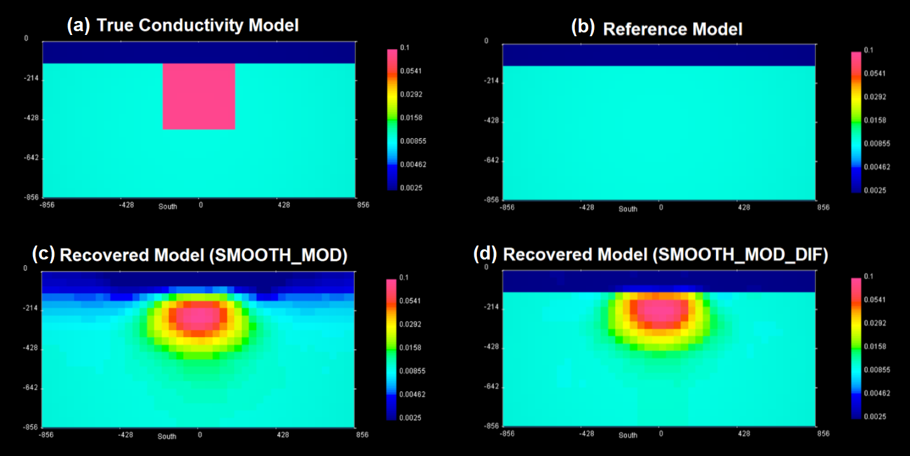

.. important:: In March of 2020, DCIP3D v5.5 was released with the intention of replacing v5.0. Online documentation is primarily intended for v5.5, although any differences in input file formats between v5.0 and v5.5 are documented when necessary.

DCIP3D v5.5 Package
===================

DCIP3D v5.5 is a program library for carrying out forward modelling and inversion of surface and borehole DC resistivity and IP data in 3D. The contents of this manual are as follows:

Highlights of DCIP3D v5.5
-------------------------

Role of Reference Model in MOF
^^^^^^^^^^^^^^^^^^^^^^^^^^^^^^

The inversion executables allow the used to include a reference model in order to constrain the inversion with a-priori information. If the user wants to preserve structures in the reference model but is unsure of their boundaries, the SMOOTH_MOD flag can be set in the code’s input file. In this case, structures in the recovered model are constrained by the reference model but will have smooth boundaries. If the user wants to preserve sharp or well-defined boundaries within the reference model, the SMOOTH_MOD_DIF flag can be set in the code’s input file.

Below, we have a DC resistivity example for 9 lines of dipole-dipole data collected over a conductive block buried beneath a resistive overburden. The true conductivity model is shown in figure (a). In figure (b) we have a reference model which provides constrains the inversion by assuming the overburden is known. In figure (c), we see the inversion result when the reference model is only included in the smallness term of the model objective. Thus we preserve the general structure of the overburden in the reference model but not its interface. In figure (d), we see the inversion result when the reference model is included in the smallness and smoothness terms of the model objective. In this case, we would like to ensure the sharp interface at the bottom of the overburden in the reference model is preserved.

Parallelization with OpenMP and MPI
^^^^^^^^^^^^^^^^^^^^^^^^^^^^^^^^^^^

Parallelization significantly reduces computation time by parsing larger processes into small mathematical operations that can be performed simultaneously. On a single CPU, the implementation of parallel computing architecture (OpenMP) now allows the user to take full advantage of multi-core processors.

Reduced IP Inversion Run-Time
^^^^^^^^^^^^^^^^^^^^^^^^^^^^^

Boundary constraints for 3D IP inversion are now enforced using a projected conjugate gradient method to reduce computation time; whereas previous versions used a log-barrier method to enforce positivity in the recovered chargeability model.

Sponsorship
-----------

The current improvements have been funded by the GIFtools Consortium which included “Potential fields and software for advanced inversion” (2012-2020) sponsored by Teck, Glencore, BHP Billiton, Vale, Cameco, Barrick, Rio Tinto, and Anglo American.

Contents
--------

.. toctree::
        :numbered:
        :maxdepth: 2

        Package overview <content/overview>
        Theoretical background <content/theory>
        Elements <content/elements>
        Running the programs <content/runPrograms>
        Examples <content/examples>
        References <references>
